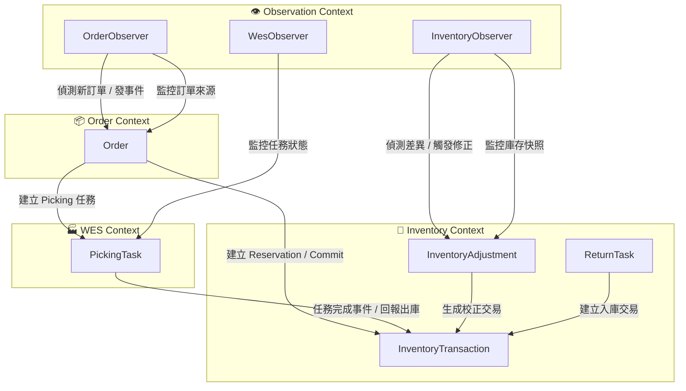
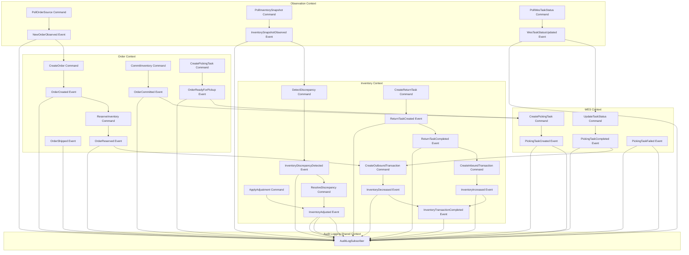

# 倉儲出貨流程協調系統（Orchestrator System）設計文件

## 1. 系統定位與角色

本系統為一套 **Orchestrator System（倉儲流程協調系統）**，負責協調與整合內部與外部系統間的出貨流程，包括：

- 訂單處理與流程分派（picking / packing）
- 庫存預約（reservation / commit）
- 自動倉揀貨任務建立與追蹤
- 出貨與物流資訊同步
- 回庫（return）流程
- 庫存一致性 Dashboard

系統角色定位：

- 並非傳統 WMS（Warehouse Management System），不直接管理貨架與儲位。
- 而是位於 **Inventory 系統、WES 系統、物流系統** 之上的協調層（Orchestration Layer）。
- 核心任務為：
    1. 驅動並追蹤整體出貨作業流程。
    2. 維持資料一致性與狀態同步。
    3. 管理異常重試與錯誤回復。

## 2. 系統整體架構

### 2.1 系統組成

| 系統名稱 | 說明 |
|-----------|------|
| **Order Source System** | 已開發完成的訂單來源系統，本系統需透過輪詢（polling）方式獲取新訂單 |
| **Orchestrator System** | 本系統，負責協調與整合流程 |
| **Inventory System** | 內部系統，提供庫存管理、reservation / commit API、與 WES 庫存同步 |
| **WES System** | 外包智慧倉儲控制系統，僅支援 API，不支援 webhook；需由本系統主動 polling 任務狀態 |
| **Logistics System** | 外包物流出貨系統，負責出貨單建立與配送狀態同步 |

## 模組

### Order Polling 模組

- 由 Orchestrator 系統定時（例如每 30 秒或 1 分鐘）呼叫 Order Source System Database
- 查詢新訂單（依狀態或建立時間區間）。
- 對於每筆新訂單：
    1. 寫入 Orchestrator 的訂單暫存表（Order Buffer Table）。
    2. 在原訂單系統中標記為「已接收」或「處理中」。
    3. 判斷訂單所屬流程類型（流程 A / 流程 B），建立對應的任務。

#### 重複偵測機制

- 每筆訂單以 `order_id` 進行 idempotent 檢查。
- 若偵測到重複訂單，忽略後續重複資料。
- 訂單狀態設計：
  - `NEW`：尚未處理
  - `IN_PROGRESS`：處理中
  - `COMPLETED`：已完成
  - `FAILED`：處理失敗，待重試或人工介入

#### 輪詢頻率與效能考量

- 預設每分鐘一次，可依負載調整。
- 若訂單量大，可採 **分區式輪詢**（依倉別或建立時間區段分批）。
- 應設計 **Job Lock 機制**，確保同時間僅一個 polling job 執行。
- 可記錄上次輪詢時間戳（last polled timestamp）以避免重疊區間。

### 資料同步模組

#### 庫存差異處理（Inventory ↔ WES）

#### 問題說明

在整合環境中，`Inventory 系統` 與 `WES 系統` 均維護庫存資料，但由於作業流程複雜、API 延遲或作業異常，兩者間可能出現以下狀況：

| 差異類型        | 說明                                                             |
| ----------- | -------------------------------------------------------------- |
| **數量差異**    | WES 回報實際庫存與 Inventory 記錄不同（例如 WES 有 95 件，但 Inventory 顯示 100 件） |
| **儲位差異**    | WES 的儲位資料與 Inventory 的倉別或區域設定不一致                               |
| **任務差異**    | WES 已完成 picking，但 Inventory 未 commit reservation               |
| **回庫/報廢差異** | WES 有異動，但 Inventory 未更新（或反之）                                   |

#### 差異可能來源

- WES API 任務回報延遲或失敗（callback/polling 超時）
- Inventory reservation/commit 流程中斷（例如系統重啟、DB transaction rollback）
- 實體倉儲作業異常（操作員誤放貨物）
- 系統批次同步任務失敗

#### 差異偵測機制

系統應具備 **雙向庫存比對機制**：

1. **WES → Inventory 定期同步任務**

- WES 端提供倉別與 SKU 層級的「庫存快照」API。
- Orchestrator 每日（或每小時）呼叫此 API，與 Inventory 系統資料比對。
- 若發現差異，記錄在 `StockDiscrepancyLog`。

2. **Inventory → WES 對照同步**

- 當 Inventory 有人工調整、退貨、報廢或庫存更動時，應主動通知 Orchestrator。
- Orchestrator 再透過 WES API 更新對應數量。
- 若更新失敗，進入「待同步佇列」。

#### 差異處理策略

#### Case：**Inventory 有庫存但 WES 顯示無庫存**

**狀況**
代表實體倉庫缺貨，但 Inventory 資料未更新。

**解法**

1. 暫停該 SKU 的自動訂單分配。
2. 通知 Inventory 系統進行校正。
3. 可由 WES 提供的快照覆蓋同步數據，更新 Inventory。

#### Case：**WES 有庫存但 Inventory 顯示為 0**

**狀況**
通常為回庫或報廢流程未更新。

**解法**

1. Orchestrator 偵測差異後自動補上 Inventory 更新。
2. 若多筆 SKU 發生類似狀況，排程全倉同步任務（Full Sync Job）。

#### Case：**兩邊庫存差異持續超過閾值**

**狀況**
例如某 SKU 差異 >5%。

**解法**

1. 自動產生 `Stock Reconciliation Task`。
2. 指派給倉庫作業員進行盤點。
3. Orchestrator 在盤點完成後重新同步雙方數據。

### 差異紀錄與報表

建立 `StockDiscrepancyLog` 資料表，紀錄所有差異事件：

| 欄位            | 說明                  |
| ------------- | ------------------- |
| sku_code      | 商品代碼                |
| warehouse_id  | 倉別代碼                |
| inventory_qty | Inventory 系統數量      |
| wes_qty       | WES 系統數量            |
| discrepancy   | 差異量                 |
| detected_at   | 偵測時間                |
| status        | `OPEN` / `RESOLVED` |
| resolved_by   | 處理人員                |
| note          | 備註                  |

報表可依照倉別、商品、時間區間進行查詢，支援每日快照比較。

#### 庫存同步策略總覽

| 情境     | 主導系統      | 同步方向        | 機制               |
| ------ | --------- | ----------- | ---------------- |
| 出貨任務完成 | WES       | → Inventory | commit API       |
| 回庫任務完成 | WES       | → Inventory | restock API      |
| 人工調整庫存 | Inventory | → WES       | update stock API |
| 定期盤點同步 | 雙向        | ↔           | 每日 Full Sync Job |

#### 建議實作要點

- 每筆庫存變動皆附帶 `transaction_id` 以追蹤來源。
- 若兩系統都支援 version number 或 updated_at 欄位，可用作增量同步依據。
- Polling 任務應有重試機制與防止重疊執行的 lock。
- 建議在 Orchestrator 加入「庫存一致性 Dashboard」，即時顯示差異統計。

## 4. 系統核心流程

### 4.1 流程 A：自動倉揀貨 → Picking Zone 待取貨

**流程說明：**
適用於需要 operator 揀貨、delivery man 取貨的情境。

**流程步驟：**

1. Polling 偵測到新訂單。
2. 呼叫 Inventory API 進行 `reservation`。
3. 呼叫 WES API 建立 picking 任務。
4. Orchestrator 定期 **polling WES 任務狀態**（由我方主動輪詢，而非依賴對方 webhook）。
5. 若 WES 回報任務完成：
    - 呼叫 Inventory API 進行 `commit`。
    - 更新內部任務狀態為「已完成」。
6. 通知內部系統或介面顯示「可取貨」。
7. Delivery man 取貨 → 呼叫 Logistics API 更新出貨狀態（例如 `dispatched`）。

### 4.2 流程 B：自動倉揀貨 + Packing List 印製

**流程說明：**
適用於由 operator 負責揀貨與包裝的情境。

**流程步驟：**

1. Polling 偵測到新訂單。
2. 呼叫 Inventory API 進行 `reservation`。
3. 呼叫 WES API 建立 picking 任務。
4. Orchestrator polling WES 任務狀態。
5. 若任務完成：
    - 呼叫 Inventory API 進行 `commit`。
    - 觸發 Packing List 印製流程。
6. 呼叫 Logistics 系統建立出貨單與標籤。
7. 更新 Orchestrator 訂單狀態為「已出貨」。

### 4.3 回庫（Return / Restock）流程

**流程說明：**
處理退貨或回庫場景。

**流程步驟：**

1. Logistics 系統或內部作業觸發回庫請求。
2. Orchestrator 建立回庫任務。
3. 呼叫 WES 建立 inbound 任務。
4. Polling WES 任務狀態。
5. 任務完成後：
    - 呼叫 Inventory API 更新庫存（增加庫存量）。
    - 更新訂單與任務狀態為「已回庫」。

### 4.4 人工盤點

**流程說明：**
適用於由 Inventory 系統與WES之間某SKU差異過大的時候。

**流程步驟：**

1. Operatro去盤點
2. 盤點完成之後更新Inventory 庫存以及 WES庫存

--

## 5. 系統整合介面（Integration Points）

| 系統 | 整合方式 | 功能 |
|------|------------|------|
| **Order Source System** | REST API（polling） | 取得新訂單清單、標記訂單狀態 |
| **Inventory System** | REST API | Reservation、Commit、庫存同步 |
| **WES System** | REST API（polling task status） | 建立揀貨任務、查詢任務狀態 |
| **Logistics System** | REST API | 建立出貨單、查詢配送狀態、建立回庫任務 |

## 6. Polling 策略與 WES 整合考量

由於 WES 雖提供 callback API，但考慮到穩定性與一致性，本系統選擇：

- **主動 polling** 模式：  
  由 Orchestrator 定期查詢 WES 任務狀態，避免遺漏 callback 或網路異常造成任務狀態錯誤。
- Polling 間隔建議：30 秒～1 分鐘，視任務量調整。
- 若發現任務長時間未更新，可觸發異常警報或人工介入。

此策略可確保：

- 任務狀態一致性。
- 降低外部系統誤觸發風險。
- 便於重試與追蹤。

--

## 7. 狀態與錯誤管理（概述）

| 狀態 | 說明 |
|------|------|
| `NEW` | 訂單新建立，尚未開始處理 |
| `IN_PROGRESS` | 任務執行中（包含 reservation / picking / packing） |
| `WAIT_FOR_PICKUP` | 已完成揀貨，等待取貨 |
| `SHIPPED` | 已出貨 |
| `RETURNING` | 回庫中 |
| `COMPLETED` | 全流程完成 |
| `FAILED` | 發生錯誤，待人工或自動重試 |

**錯誤處理策略：**

- 針對可恢復錯誤（如 API timeout、暫時性失敗）→ 自動重試（最多 3 次）。
- 不可恢復錯誤（如資料不一致、無庫存）→ 記錄 error log 並進入人工審核。
- 所有外部呼叫均應具備 **request log** 與 **correlation ID** 以利追蹤。

## 🧭 Tactical Design — Domain Aggregates Overview

本章節說明系統中的核心 Aggregate 設計與責任劃分。
系統整體由多個 Context 組成，包含：

- **Order Context**
- **Inventory Context**
- **WES Context**
- **Observation Context**

## 🏷️ Aggregate Summary

| Aggregate               | 所屬 Context         | 責任                                                                 | 關聯物件                                       |
| ----------------------- | -------------------- | -------------------------------------------------------------------- | ------------------------------------------ |
| **Order**               | Order Context        | 表示出貨流程主體，包含狀態、任務鏈、對應的 reservation 與 logistics info | `OrderLineItem`, `Reservation`, `Shipment` |
| **PickingTask**         | WES Context          | 對應 WES 的揀貨任務，負責管理任務狀態與回報                               | `TaskStatus`, `WesTaskId`                  |
| **InventoryTransaction**| Inventory Context    | 表示庫存異動（入庫、出庫、調撥等），是實際改變庫存數量的行為主體                | `InventoryItem`, `MovementType`, `TransactionLine` |
| **InventoryAdjustment** | Inventory Context    | 偵測與修正庫存差異，建立對應的 `InventoryTransaction` 校正庫存                | `StockSnapshot`, `DiscrepancyLog`          |
| **ReturnTask**          | Inventory Context    | 管理退貨或回庫作業流程，最終生成入庫類型的 `InventoryTransaction`              | `InboundTask`, `RestockAction`             |
| **OrderObserver**       | Observation Context  | 觀察外部訂單來源系統，偵測新訂單或狀態變化，發佈對應的觀察事件                     | `ObservationPolicy`, `ObservationResult`   |
| **InventoryObserver**   | Observation Context  | 定期比對內外部庫存數據，偵測差異並產生同步事件                                 | `StockSnapshot`, `ObservationResult`       |
| **WesObserver**         | Observation Context  | 監控 WES 任務執行情況與 API 狀態，回報異常與延遲資訊                           | `ObservationTask`, `ObservationEvent`      |

## ⚙️ Aggregate Relationships Overview



## 🧭 Tactical Design — Detailed Domain Model

## 1. Contexts & Aggregates Overview

以下是目前的 Context 劃分：

| Context                 | Aggregate                                                   |
| ----------------------- | ----------------------------------------------------------- |
| **Order Context**       | `Order`                                                     |
| **WES Context**         | `PickingTask`                                               |
| **Inventory Context**   | `InventoryTransaction`, `InventoryAdjustment`, `ReturnTask` |
| **Observation Context** | `OrderObserver`, `InventoryObserver`, `WesObserver`         |

---

## 2. Aggregate Command & Domain Event 定義

### 🧩 **Order Context**

#### Aggregate: `Order`

| 類型          | 名稱                       | 說明                             |
| ----------- | ------------------------ | ------------------------------ |
| **Command** | `CreateOrder(orderData)` | 建立新訂單（由 OrderObserver 或上游系統觸發） |
| **Command** | `ReserveInventory()`     | 呼叫 Inventory Context 進行預約庫存    |
| **Command** | `CommitInventory()`      | 庫存扣減完成，確認出貨                    |
| **Command** | `CreatePickingTask()`    | 產生對應的 WES picking 任務           |
| **Event**   | `OrderCreated`           | 訂單建立完成                         |
| **Event**   | `OrderReserved`          | 完成庫存預約                         |
| **Event**   | `OrderCommitted`         | 完成庫存扣減                         |
| **Event**   | `OrderReadyForPickup`    | 任務完成、等待出貨                      |
| **Event**   | `OrderShipped`           | 已出貨                            |
| **Event**   | `OrderFailed`            | 處理異常                           |

---

### 🏭 **WES Context**

#### Aggregate: `PickingTask`

| 類型          | 名稱                                    | 說明                               |
| ----------- | ------------------------------------- | -------------------------------- |
| **Command** | `CreatePickingTask(orderId, skuList)` | 建立 WES picking 任務                |
| **Command** | `UpdateTaskStatus(status)`            | Polling 更新任務狀態                   |
| **Event**   | `PickingTaskCreated`                  | 任務建立成功                           |
| **Event**   | `PickingTaskCompleted`                | 任務完成（觸發 InventoryTransaction 出庫） |
| **Event**   | `PickingTaskFailed`                   | 任務異常                             |

---

### 🏬 **Inventory Context**

#### Aggregate: `InventoryTransaction`

| 類型          | 名稱                                            | 說明          |
| ----------- | --------------------------------------------- | ----------- |
| **Command** | `CreateInboundTransaction(source, sku, qty)`  | 入庫交易（回庫或補貨） |
| **Command** | `CreateOutboundTransaction(source, sku, qty)` | 出庫交易（出貨或報廢） |
| **Command** | `ApplyAdjustment(adjustmentId, sku, diffQty)` | 根據調整任務修正庫存  |
| **Event**   | `InventoryIncreased`                          | 庫存增加        |
| **Event**   | `InventoryDecreased`                          | 庫存減少        |
| **Event**   | `InventoryTransactionCompleted`               | 庫存異動完成      |

---

#### Aggregate: `InventoryAdjustment`

| 類型          | 名稱                                        | 說明          |
| ----------- | ----------------------------------------- | ----------- |
| **Command** | `DetectDiscrepancy(snapshotA, snapshotB)` | 比對內外庫存，偵測差異 |
| **Command** | `ResolveDiscrepancy(sku, adjustmentQty)`  | 修正庫存差異      |
| **Event**   | `InventoryDiscrepancyDetected`            | 發現庫存差異      |
| **Event**   | `InventoryAdjusted`                       | 差異修正完成      |

---

#### Aggregate: `ReturnTask`

| 類型          | 名稱                                   | 說明                               |
| ----------- | ------------------------------------ | -------------------------------- |
| **Command** | `CreateReturnTask(orderId, skuList)` | 建立回庫任務                           |
| **Command** | `ConfirmReturnReceived()`            | 確認回庫完成                           |
| **Event**   | `ReturnTaskCreated`                  | 任務建立成功                           |
| **Event**   | `ReturnTaskCompleted`                | 回庫完成（觸發 InventoryTransaction 入庫） |

### 👁️ **Observation Context**

#### Aggregate: `OrderObserver`

| 類型          | 名稱                  | 說明                         |
| ----------- | ------------------- | -------------------------- |
| **Command** | `PollOrderSource()` | 定期輪詢訂單來源系統                 |
| **Event**   | `NewOrderObserved`  | 偵測到新訂單，發送事件給 Order Context |

#### Aggregate: `InventoryObserver`

| 類型          | 名稱                             | 說明                             |
| ----------- | ------------------------------ | ------------------------------ |
| **Command** | `PollInventorySnapshot()`      | 取得最新庫存快照                       |
| **Event**   | `InventorySnapshotObserved`    | 偵測到庫存快照                        |
| **Event**   | `InventoryDiscrepancyDetected` | 發現庫存差異（觸發 InventoryAdjustment） |

#### Aggregate: `WesObserver`

| 類型          | 名稱                     | 說明                     |
| ----------- | ---------------------- | ---------------------- |
| **Command** | `PollWesTaskStatus()`  | 輪詢 WES 任務狀態            |
| **Event**   | `WesTaskStatusUpdated` | 任務狀態更新（通知 PickingTask） |

--

## 3. 戰術實作層（Tactical Implementation Layer）

```
src/
└── main/
    └── java/
        └── com/
            └── wei/
                └── orchestrator/
                    ├── order/
                    │   ├── api/
                    │   │   ├── OrderController.java
                    │   │   └── dto/
                    │   │       ├── CreateOrderRequest.java
                    │   │       └── OrderResponse.java
                    │   │
                    │   ├── application/
                    │   │   ├── OrderApplicationService.java
                    │   │   ├── command/
                    │   │   │   ├── CreateOrderCommand.java
                    │   │   │   ├── ReserveInventoryCommand.java
                    │   │   │   └── MarkAsShippedCommand.java
                    │   │   └── handler/
                    │   │       └── OrderCommandHandler.java
                    │   │
                    │   ├── domain/
                    │   │   ├── model/
                    │   │   │   ├── Order.java
                    │   │   │   ├── OrderLineItem.java
                    │   │   │   ├── ReservationInfo.java
                    │   │   │   ├── ShipmentInfo.java
                    │   │   │   └── valueobject/
                    │   │   │       └── OrderStatus.java
                    │   │   ├── event/
                    │   │   │   ├── OrderCreatedEvent.java
                    │   │   │   ├── OrderReservedEvent.java
                    │   │   │   └── OrderShippedEvent.java
                    │   │   ├── repository/
                    │   │   │   └── OrderRepository.java
                    │   │   └── service/
                    │   │       └── OrderDomainService.java
                    │   │
                    │   └── infrastructure/
                    │       ├── repository/
                    │       │   └── JpaOrderRepository.java
                    │       ├── mapper/
                    │       │   └── OrderMapper.java
                    │       └── persistence/
                    │           └── OrderEntity.java
                    │
                    ├── inventory/
                    │   ├── api/
                    │   │   └── InventoryController.java
                    │   ├── application/
                    │   │   ├── InventoryApplicationService.java
                    │   │   └── command/
                    │   │       ├── CreateInboundTransactionCommand.java
                    │   │       ├── DetectDiscrepancyCommand.java
                    │   │       └── ResolveDiscrepancyCommand.java
                    │   ├── domain/
                    │   │   ├── model/
                    │   │   │   ├── InventoryTransaction.java
                    │   │   │   ├── InventoryAdjustment.java
                    │   │   │   ├── ReturnTask.java
                    │   │   │   ├── TransactionLine.java
                    │   │   │   └── valueobject/
                    │   │   │       ├── TransactionType.java
                    │   │   │       ├── TransactionStatus.java
                    │   │   │       └── WarehouseLocation.java
                    │   │   ├── event/
                    │   │   │   ├── InventoryAdjustedEvent.java
                    │   │   │   └── TransactionPostedEvent.java
                    │   │   ├── repository/
                    │   │   │   └── InventoryRepository.java
                    │   │   └── service/
                    │   │       └── InventoryDomainService.java
                    │   └── infrastructure/
                    │       ├── repository/
                    │       │   └── JpaInventoryRepository.java
                    │       ├── mapper/
                    │       │   └── InventoryMapper.java
                    │       └── adapter/
                    │           └── ExternalWmsAdapter.java
                    │
                    ├── wes/
                    │   ├── application/
                    │   │   ├── WesTaskApplicationService.java
                    │   │   └── command/
                    │   │       └── SyncPickingTaskCommand.java
                    │   ├── domain/
                    │   │   ├── model/
                    │   │   │   └── PickingTask.java
                    │   │   ├── event/
                    │   │   │   └── PickingTaskUpdatedEvent.java
                    │   │   ├── repository/
                    │   │   │   └── PickingTaskRepository.java
                    │   │   └── valueobject/
                    │   │       └── WesTaskId.java
                    │   └── infrastructure/
                    │       ├── adapter/
                    │       │   └── WesHttpClient.java
                    │       └── repository/
                    │           └── JpaPickingTaskRepository.java
                    │
                    ├── observation/
                    │   ├── application/
                    │   │   ├── ObservationScheduler.java
                    │   │   ├── PollingCoordinator.java
                    │   │   └── command/
                    │   │       ├── PollOrderSourceCommand.java
                    │   │       ├── PollInventorySnapshotCommand.java
                    │   │       └── PollWesStatusCommand.java
                    │   ├── domain/
                    │   │   ├── model/
                    │   │   │   ├── OrderObserver.java
                    │   │   │   ├── InventoryObserver.java
                    │   │   │   ├── WesObserver.java
                    │   │   │   └── valueobject/
                    │   │   │       ├── SourceEndpoint.java
                    │   │   │       ├── PollingInterval.java
                    │   │   │       └── ObservationRule.java
                    │   │   ├── event/
                    │   │   │   ├── OrderSourcePolledEvent.java
                    │   │   │   └── WesTaskPolledEvent.java
                    │   │   └── repository/
                    │   │       └── ObserverRepository.java
                    │   └── infrastructure/
                    │       ├── http/
                    │       │   └── ExternalApiClient.java
                    │       └── scheduler/
                    │           └── PollingJobConfig.java
                    │
                    └── shared/
                        ├── domain/
                        │   ├── model/
                        │   │   ├── AuditRecord.java
                        │   │   └── valueobject/
                        │   │       └── EventMetadata.java
                        │   └── service/
                        │       ├── DomainEventPublisher.java
                        │       └── AuditService.java
                        └── infrastructure/
                            ├── repository/
                            │   └── AuditRepositoryImpl.java
                            └── persistence/
                                └── AuditRecordEntity.java
```

## 4. Audit Logging 的戰術設計

因為 **Audit Logging** 是全域關注點（Cross-cutting Concern），
最適合放在一個 **Shared Kernel / Shared Context** 中，
以 **事件訂閱 (Event Subscriber)** 或 **Decorator Pattern** 的方式自動記錄。

### ✅ 建議設計

| 類型                | 名稱                   | 說明                          |
| ----------------- | -------------------- | --------------------------- |
| **Entity**        | `AuditLog`           | 紀錄發生的事件內容與執行命令              |
| **Event Handler** | `AuditLogSubscriber` | 訂閱所有 Domain Event，自動寫入紀錄    |
| **Repository**    | `AuditLogRepository` | 儲存審計紀錄（DB or ElasticSearch） |

## 🧭 **Command–Event Flow (跨 Context 互動圖)**



--

### 🟦 1. Observation Context

- 定期輪詢上游資料源（例如 ERP / WES / WMS）。
- 當偵測到新訂單或庫存異常，觸發對應事件：

  - `NewOrderObserved` → 觸發 `CreateOrder`
  - `InventorySnapshotObserved` → 觸發 `DetectDiscrepancy`
  - `WesTaskStatusUpdated` → 觸發 `UpdateTaskStatus`

---

### 🟧 2. Order Context

- 收到 `NewOrderObserved` 後建立 `Order`。
- 預約庫存 (`ReserveInventory`) → 由 Inventory Context 執行。
- 出貨完成後 (`OrderCommitted`、`OrderShipped`) 通知 Audit Logging。

---

### 🟨 3. WES Context

- `CreatePickingTask` 由 Order Context 觸發。
- 任務完成 (`PickingTaskCompleted`) 後，觸發 Inventory 出庫 (`CreateOutboundTransaction`)。
- 任務異常 (`PickingTaskFailed`) 則回報 Audit。

---

### 🟩 4. Inventory Context

- `InventoryTransaction` 處理所有入庫、出庫交易。
- `InventoryAdjustment` 處理庫存差異。
- `ReturnTask` 處理回庫與退貨。
- 所有異動事件（Increased / Decreased / Adjusted）皆被 Audit 記錄。

---

### 🟪 5. Audit Logging

- 為 **全域訂閱者 (Event Subscriber)**。
- 訂閱所有 `DomainEvent`。
- 記錄：

  - Aggregate ID
  - Command / Event Type
  - Timestamp
  - Payload（含來源 Context）

## ⚙️ 延伸建議

若要實作此事件流：

- 使用 **Event Bus（例如 Spring ApplicationEventPublisher / Kafka）**。
- 各 Context 不直接依賴彼此，而是透過事件通訊。
- `AuditLogSubscriber` 可以 async 模式記錄，不影響主流程性能。

--

## 領域模型結構圖（Domain Model Structure Diagram）

```mermaid
%% DDD Tactical Design Diagram: Aggregates, Entities, Value Objects

classDiagram
direction LR

%% ===========================
%%  Order Context
%% ===========================
class Order {
  +orderId
  +status: OrderStatus
  +reservationInfo: ReservationInfo
  +shipmentInfo: ShipmentInfo
  +List~OrderLineItem~
  --
  +createOrder()
  +reserveInventory()
  +commitOrder()
  +markAsShipped()
}

class OrderLineItem {
  +sku
  +quantity
  +price
}

class ReservationInfo {
  +warehouseId
  +reservedQty
  +status
}

class ShipmentInfo {
  +carrier
  +trackingNumber
}

class OrderStatus {
  <<ValueObject>>
  +status: CREATED | RESERVED | COMMITTED | SHIPPED
}

Order "1" --> "many" OrderLineItem
Order --> ReservationInfo
Order --> ShipmentInfo
Order --> OrderStatus

%% ===========================
%%  WES Context
%% ===========================
class PickingTask {
  +taskId
  +status: TaskStatus
  +wesTaskId: WesTaskId
  --
  +createPickingTask()
  +updateTaskStatus()
}

class TaskStatus {
  <<ValueObject>>
  +status: PENDING | IN_PROGRESS | COMPLETED | FAILED
}

class WesTaskId {
  <<ValueObject>>
  +value: String
}

PickingTask --> TaskStatus
PickingTask --> WesTaskId

%% ===========================
%%  Inventory Context
%% ===========================

class InventoryTransaction {
  +transactionId
  +type: TransactionType
  +warehouseLocation: WarehouseLocation
  +status: TransactionStatus
  +List~TransactionLine~
  --
  +createInboundTransaction()
  +createOutboundTransaction()
  +applyAdjustment()
}

class TransactionLine {
  +sku
  +quantity
}

class TransactionType {
  <<ValueObject>>
  +type: INBOUND | OUTBOUND | ADJUSTMENT
}

class WarehouseLocation {
  <<ValueObject>>
  +warehouseId
  +zone
}

class TransactionStatus {
  <<ValueObject>>
  +status: CREATED | POSTED | FAILED
}

InventoryTransaction "1" --> "many" TransactionLine
InventoryTransaction --> TransactionType
InventoryTransaction --> WarehouseLocation
InventoryTransaction --> TransactionStatus

%% --- InventoryAdjustment Aggregate ---
class InventoryAdjustment {
  +adjustmentId
  +status
  +List~DiscrepancyLog~
  --
  +detectDiscrepancy()
  +resolveDiscrepancy()
}

class StockSnapshot {
  <<ValueObject>>
  +sku
  +quantity
  +warehouseId
}

class DiscrepancyLog {
  <<ValueObject>>
  +sku
  +inventoryQty
  +wesQty
  +difference
}

InventoryAdjustment --> StockSnapshot
InventoryAdjustment "1" --> "many" DiscrepancyLog

%% --- ReturnTask Aggregate ---
class ReturnTask {
  +returnTaskId
  +status
  +List~ReturnItem~
  --
  +createReturnTask()
  +completeReturnTask()
}

class ReturnItem {
  <<ValueObject>>
  +sku
  +quantity
  +condition
}

class ReturnReason {
  <<ValueObject>>
  +reasonCode
  +description
}

ReturnTask "1" --> "many" ReturnItem
ReturnTask --> ReturnReason


%% ===========================
%%  Observation Context
%% ===========================

class OrderObserver {
  +observerId
  +sourceEndpoint: SourceEndpoint
  +pollingInterval: PollingInterval
  +lastPolledTimestamp
  --
  +pollOrderSource()
  +updateLastPolledTimestamp()
}

class SourceEndpoint {
  <<ValueObject>>
  +jdbcUrl
  +username
  +password
}

class PollingInterval {
  <<ValueObject>>
  +seconds
}

class ObservationResult {
  <<ValueObject>>
  +orderId
  +orderType
  +warehouseId
  +status
  +observedAt
}

OrderObserver --> SourceEndpoint
OrderObserver --> PollingInterval
OrderObserver --> ObservationResult

class InventoryObserver {
  +observerId
  +observationRule: ObservationRule
  --
  +pollInventorySnapshot()
}

class ObservationRule {
  <<ValueObject>>
  +thresholdPercent
  +checkFrequency
}

InventoryObserver --> ObservationRule

class WesObserver {
  +observerId
  +taskEndpoint: TaskEndpoint
  --
  +pollWesTaskStatus()
}

class TaskEndpoint {
  <<ValueObject>>
  +url
  +authToken
}

WesObserver --> TaskEndpoint

%% ===========================
%%  Shared Context (Audit Logging)
%% ===========================
class AuditRecord {
  +recordId
  +aggregateType
  +aggregateId
  +eventName
  +eventTimestamp
  +eventMetadata: EventMetadata
  --
  +recordAuditLog()
}

class EventMetadata {
  <<ValueObject>>
  +context
  +correlationId
  +triggerSource
}

AuditRecord --> EventMetadata
```



## Event 流程圖

```mermaid
%% DDD Command → Event 流程圖
flowchart TD

subgraph OrderContext [Order Context]
  CMD_CreateOrder[Command: CreateOrder]
  CMD_ConfirmOrder[Command: ConfirmOrder]
  CMD_CompleteOrder[Command: CompleteOrder]
  EVT_OrderCreated[Event: OrderCreated]
  EVT_OrderConfirmed[Event: OrderConfirmed]
  EVT_OrderCompleted[Event: OrderCompleted]

  CMD_CreateOrder -->|validates and builds| EVT_OrderCreated
  CMD_ConfirmOrder -->|transitions state| EVT_OrderConfirmed
  CMD_CompleteOrder -->|finalizes workflow| EVT_OrderCompleted
end

subgraph InventoryContext [Inventory Context]
  CMD_RegisterMovement[Command: RegisterInventoryMovement]
  CMD_AdjustInventory[Command: AdjustInventoryDiscrepancy]
  CMD_ProcessReturn[Command: ProcessReturnTask]

  EVT_InventoryIncreased[Event: InventoryIncreased]
  EVT_InventoryDecreased[Event: InventoryDecreased]
  EVT_InventoryAdjusted[Event: InventoryAdjusted]
  EVT_ReturnProcessed[Event: ReturnProcessed]

  CMD_RegisterMovement -->|Inbound| EVT_InventoryIncreased
  CMD_RegisterMovement -->|Outbound| EVT_InventoryDecreased
  CMD_AdjustInventory --> EVT_InventoryAdjusted
  CMD_ProcessReturn --> EVT_ReturnProcessed
end

subgraph WesContext [WES Context]
  CMD_CreatePickingTask[Command: CreatePickingTask]
  CMD_ReportPickingProgress[Command: ReportPickingProgress]
  CMD_CompletePickingTask[Command: CompletePickingTask]

  EVT_PickingTaskCreated[Event: PickingTaskCreated]
  EVT_PickingProgressReported[Event: PickingProgressReported]
  EVT_PickingTaskCompleted[Event: PickingTaskCompleted]

  CMD_CreatePickingTask --> EVT_PickingTaskCreated
  CMD_ReportPickingProgress --> EVT_PickingProgressReported
  CMD_CompletePickingTask --> EVT_PickingTaskCompleted
end

subgraph ObservationContext [Observation Context]
  CMD_PollOrderSource[Command: PollOrderSource]
  CMD_PollInventory[Command: PollInventory]
  CMD_PollWes[Command: PollWes]

  EVT_OrderSourceObserved[Event: OrderSourceObserved]
  EVT_InventoryObserved[Event: InventoryObserved]
  EVT_WesObserved[Event: WesObserved]

  CMD_PollOrderSource --> EVT_OrderSourceObserved
  CMD_PollInventory --> EVT_InventoryObserved
  CMD_PollWes --> EVT_WesObserved
end

subgraph AuditContext [Audit Logging Context]
  CMD_RecordAudit[Command: RecordAuditLog]
  EVT_AuditRecorded[Event: AuditRecorded]
  CMD_RecordAudit --> EVT_AuditRecorded
end

%% Cross Context Event Flow
EVT_OrderCreated --> CMD_CreatePickingTask
EVT_PickingTaskCompleted --> CMD_CompleteOrder
EVT_InventoryAdjusted --> CMD_RecordAudit
EVT_ReturnProcessed --> CMD_RecordAudit
EVT_OrderCompleted --> CMD_RecordAudit
EVT_WesObserved --> CMD_ReportPickingProgress
```


