# 倉儲出貨流程協調系統（Orchestrator System）設計文件

## 系統定位與角色

本系統為一套 **Orchestrator System（倉儲流程協調系統）**，負責協調與整合內部與外部系統間的出貨流程，包括：

- 訂單處理與流程分派（picking / packing）
- 庫存預約（reservation / commit）
- 自動倉揀貨任務建立與追蹤
- 出貨與物流資訊同步
- 回庫（return）流程
- 庫存一致性 Dashboard

系統角色定位：

- 並非傳統 WMS（Warehouse Management System），不直接管理貨架與儲位。
- 而是位於 **Inventory 系統、WES 系統、物流系統** 之上的協調層（Orchestration Layer）。
- 核心任務為：
    1. 驅動並追蹤整體出貨作業流程。
    2. 維持資料一致性與狀態同步。
    3. 管理異常重試與錯誤回復。

## 系統整體架構

### 系統組成

| 系統名稱 | 說明 |
|-----------|------|
| **Order Source System** | 已開發完成的訂單來源系統，本系統需透過輪詢（polling）方式獲取新訂單 |
| **Orchestrator System** | 本系統，負責協調與整合流程 |
| **Inventory System** | 內部系統，提供庫存管理、reservation / commit API、與 WES 庫存同步 |
| **WES System** | 外包智慧倉儲控制系統，僅支援 API，不支援 webhook；需由本系統主動 polling 任務狀態 |
| **Logistics System** | 外包物流出貨系統，負責出貨單建立與配送狀態同步 |

## 系統核心流程

### 流程 A：自動倉揀貨 → Picking Zone 待取貨

**流程說明：**
適用於需要 operator 揀貨、delivery man 取貨的情境。

**流程步驟：**

1. Polling 偵測到新訂單。
2. 呼叫 Inventory API 進行 `reservation`。
3. 呼叫 WES API 建立 picking 任務。
4. Orchestrator 定期 **polling WES 任務狀態**（由我方主動輪詢，而非依賴對方 webhook）。
5. 若 WES 回報任務完成：
    - 呼叫 Inventory API 進行 `commit`。
    - 更新內部任務狀態為「已完成」。
6. 通知內部系統或介面顯示「可取貨」。
7. Delivery man 取貨 → 呼叫 Logistics API 更新出貨狀態（例如 `dispatched`）。

### 流程 B：自動倉揀貨 + Packing List 印製

**流程說明：**
適用於由 operator 負責揀貨與包裝的情境。

**流程步驟：**

1. Polling 偵測到新訂單。
2. 呼叫 Inventory API 進行 `reservation`。
3. 呼叫 WES API 建立 picking 任務。
4. Orchestrator polling WES 任務狀態。
5. 若任務完成：
    - 呼叫 Inventory API 進行 `commit`。
    - 觸發 Packing List 印製流程。
6. 呼叫 Logistics 系統建立出貨單與標籤。
7. 更新 Orchestrator 訂單狀態為「已出貨」。

### 回庫（Return / Restock）流程

**流程說明：**
處理退貨或回庫場景。

**流程步驟：**

1. Logistics 系統或內部作業觸發回庫請求。
2. Orchestrator 建立回庫任務。
3. 呼叫 WES 建立 inbound 任務。
4. Polling WES 任務狀態。
5. 任務完成後：
    - 呼叫 Inventory API 更新庫存（增加庫存量）。
    - 更新訂單與任務狀態為「已回庫」。

### 人工盤點

**流程說明：**
適用於由 Inventory 系統與WES之間某SKU差異過大的時候。

**流程步驟：**

1. Operatro去盤點
2. 盤點完成之後更新Inventory 庫存以及 WES庫存

--

## 5. 系統整合介面（Integration Points）

| 系統 | 整合方式 | 功能 |
|------|------------|------|
| **Order Source System** | REST API（polling） | 取得新訂單清單、標記訂單狀態 |
| **Inventory System** | REST API | Reservation、Commit、庫存同步 |
| **WES System** | REST API（polling task status） | 建立揀貨任務、查詢任務狀態 |
| **Logistics System** | REST API | 建立出貨單、查詢配送狀態、建立回庫任務 |

## 6. Polling 策略與 WES 整合考量

由於 WES 雖提供 callback API，但考慮到穩定性與一致性，本系統選擇：

- **主動 polling** 模式：  
  由 Orchestrator 定期查詢 WES 任務狀態，避免遺漏 callback 或網路異常造成任務狀態錯誤。
- Polling 間隔建議：30 秒～1 分鐘，視任務量調整。
- 若發現任務長時間未更新，可觸發異常警報或人工介入。

此策略可確保：

- 任務狀態一致性。
- 降低外部系統誤觸發風險。
- 便於重試與追蹤。

--

## 7. 狀態與錯誤管理（概述）

| 狀態 | 說明 |
|------|------|
| `NEW` | 訂單新建立，尚未開始處理 |
| `IN_PROGRESS` | 任務執行中（包含 reservation / picking / packing） |
| `WAIT_FOR_PICKUP` | 已完成揀貨，等待取貨 |
| `SHIPPED` | 已出貨 |
| `RETURNING` | 回庫中 |
| `COMPLETED` | 全流程完成 |
| `FAILED` | 發生錯誤，待人工或自動重試 |

**錯誤處理策略：**

- 針對可恢復錯誤（如 API timeout、暫時性失敗）→ 自動重試（最多 3 次）。
- 不可恢復錯誤（如資料不一致、無庫存）→ 記錄 error log 並進入人工審核。
- 所有外部呼叫均應具備 **request log** 與 **correlation ID** 以利追蹤。

## 🧭 Tactical Design — Domain Aggregates Overview

本章節說明系統中的核心 Aggregate 設計與責任劃分。
系統整體由多個 Context 組成，包含：

- **Order Context**
- **Inventory Context**
- **WES Context**
- **Observation Context**

## 🏷️ Aggregate Summary

| Aggregate               | 所屬 Context         | 責任                                                                 | 關聯物件                                       |
| ----------------------- | -------------------- | -------------------------------------------------------------------- | ------------------------------------------ |
| **Order**               | Order Context        | 表示出貨流程主體，包含狀態與多個 OrderLineItem（Entity），每個項目追蹤自己的 reservation 與 commitment 狀態 | `OrderLineItem` (Entity), `LineReservationInfo`, `LineCommitmentInfo`, `ShipmentInfo` |
| **PickingTask**         | WES Context          | 管理揀貨任務（出庫），支援雙來源模型 (ORCHESTRATOR_SUBMITTED / WES_DIRECT)，完成時減少庫存 | `TaskItem`, `WesTaskId`, `TaskOrigin`, `TaskStatus` |
| **PutawayTask**         | WES Context          | 管理上架任務（入庫），支援雙來源模型，完成時增加庫存，處理退貨與收貨場景 | `TaskItem`, `WesTaskId`, `TaskOrigin`, `SourceType` |
| **InventoryTransaction**| Inventory Context    | 表示庫存異動（入庫、出庫、調撥等），是實際改變庫存數量的行為主體                | `TransactionLine`, `TransactionType`, `WarehouseLocation` |
| **InventoryAdjustment** | Inventory Context    | 偵測與修正庫存差異，建立對應的 `InventoryTransaction` 校正庫存                | `StockSnapshot`, `DiscrepancyLog`          |
| **OrderObserver**       | Observation Context  | 觀察外部訂單來源資料庫（Oracle），透過 OrderSourcePort 查詢新訂單完整資料，內部收集 NewOrderObservedEvent 並發佈 | `SourceEndpoint`, `PollingInterval`, `ObservationResult`, `ObservedOrderItem` |
| **InventoryObserver**   | Observation Context  | 定期比對內外部庫存數據，偵測差異並產生同步事件                                 | `StockSnapshot`, `ObservationResult`       |
| **WesObserver**         | Observation Context  | 持續輪詢 WES 系統，發現新任務 (task discovery) 並同步所有任務狀態，確保庫存一致性 | `TaskEndpoint`, `WesTaskDto`      |

## ⚙️ Aggregate Relationships Overview

本節展示 Aggregate 之間的關係與互動模式，採用 **事件驅動架構 (Event-Driven Architecture)** 設計。

### 關鍵設計原則

- **Context 間透過事件通訊**：降低耦合，確保邊界清晰
- **Anti-Corruption Layer**：使用 Port 介面隔離外部系統
- **Dual-Origin Model**：WES 任務支援雙來源（Orchestrator / WES Direct）
- **Reservation Lifecycle**：完整的庫存預約生命週期管理

```mermaid
graph TD

%% =========================
%% ORDER CONTEXT
%% =========================
subgraph OrderContext["📦 Order Context"]
  direction TB
  OR[Order<br/>訂單聚合根]
  OMR[OrderManualReview<br/>人工審核聚合根]
end

%% =========================
%% WES CONTEXT
%% =========================
subgraph WesContext["🏭 WES Context"]
  direction TB
  PT[PickingTask<br/>揀貨任務<br/>出庫 - 減少庫存]
  PUT[PutawayTask<br/>上架任務<br/>入庫 - 增加庫存]
end

%% =========================
%% INVENTORY CONTEXT
%% =========================
subgraph InventoryContext["🏬 Inventory Context"]
  direction TB
  IT[InventoryTransaction<br/>庫存交易<br/>Reserve/Consume/Release]
  IA[InventoryAdjustment<br/>庫存差異調整]
end

%% =========================
%% OBSERVATION CONTEXT
%% =========================
subgraph ObservationContext["👁️ Observation Context"]
  direction TB
  OO[OrderObserver<br/>訂單觀察者]
  IO[InventoryObserver<br/>庫存觀察者]
  WO[WesObserver<br/>任務發現 + 狀態同步]
end

%% =========================
%% INFRASTRUCTURE
%% =========================
subgraph Infrastructure["⚙️ Infrastructure Layer"]
  direction TB
  FS[FulfillmentScheduler<br/>履約排程器<br/>定期檢查 SCHEDULED 訂單]
end

%% =========================
%% EXTERNAL SYSTEMS
%% =========================
subgraph ExternalSystems["🌐 External Systems"]
  direction TB
  OSS[Order Source System<br/>Oracle Database]
  INV_SYS[Inventory System<br/>外部庫存 API]
  WES_SYS[WES System<br/>wes_tasks table<br/>揀貨/上架任務]
end

%% ========================================
%% CROSS-CONTEXT EVENT-DRIVEN INTERACTIONS
%% ========================================

%% 1. Observation → Order: 新訂單偵測 (Event-Driven)
OO -.->|NewOrderObservedEvent| OR

%% 2. Scheduled Fulfillment: FulfillmentScheduler 觸發
FS -.->|OrderReadyForFulfillmentEvent<br/>時間窗口到達| OR

%% 3. Order → Inventory: 預約庫存 (Event → Command)
OR -.->|OrderReadyForFulfillmentEvent<br/>→ ReserveInventoryCommand| IT

%% 4. Inventory → Order: 預約結果 (Event-Driven)
IT -.->|InventoryReservedEvent| OR
IT -.->|ReservationFailedEvent<br/>→ OrderFulfillmentFailedEvent| OR

%% 5. Order → OrderManualReview: 履約失敗處理
OR -.->|OrderFulfillmentFailedEvent<br/>→ MoveToManualReviewCommand| OMR

%% 6. Order → WES: 建立揀貨任務 (Event-Driven)
OR -.->|OrderReservedEvent<br/>→ CreatePickingTaskForOrderCommand<br/>ORCHESTRATOR_SUBMITTED| PT

%% 7. WesObserver → WES Tasks: 任務發現 & 狀態同步
WO -.->|WesTaskDiscoveredEvent<br/>→ CreatePickingTaskFromWesCommand<br/>WES_DIRECT| PT
WO -.->|WesTaskDiscoveredEvent<br/>→ CreatePutawayTaskFromWesCommand<br/>WES_DIRECT| PUT
WO -.->|WesTaskStatusUpdatedEvent<br/>→ MarkTaskCompletedCommand| PT
WO -.->|WesTaskStatusUpdatedEvent<br/>→ MarkTaskCompletedCommand| PUT

%% 8. PickingTask → Inventory: 揀貨完成 - 消耗預約 (Event-Driven)
PT -.->|PickingTaskCompletedEvent<br/>→ ConsumeReservationCommand<br/>→ CreateOutboundTransactionCommand<br/>減少庫存| IT

%% 9. PutawayTask → Inventory: 上架完成 - 入庫 (Event-Driven)
PUT -.->|PutawayTaskCompletedEvent<br/>→ CreateInboundTransactionCommand<br/>增加庫存| IT

%% 10. Inventory Observer → Inventory Adjustment: 差異偵測
IO -.->|InventorySnapshotObservedEvent<br/>→ DetectDiscrepancyCommand| IA

%% 11. Inventory Adjustment → Inventory Transaction: 校正庫存
IA -.->|InventoryDiscrepancyDetectedEvent<br/>→ ApplyAdjustmentCommand| IT

%% ========================================
%% PORT INTEGRATIONS (Anti-Corruption Layer)
%% ========================================

%% Order Observer → External Order Source (via OrderSourcePort)
OO ===>|OrderSourcePort<br/>pollOrderSource| OSS

%% Inventory Transaction → External Inventory System (via InventoryPort)
IT ===>|InventoryPort<br/>reserve/consume/release| INV_SYS

%% WES Tasks → External WES System (via WesPort)
PT ===>|WesPort<br/>submitPickingTask| WES_SYS
PUT ===>|WesPort<br/>submitPutawayTask| WES_SYS
WO ===>|WesPort<br/>pollAllTasks| WES_SYS

%% Inventory Observer → External Inventory System
IO ===>|InventoryPort<br/>getInventorySnapshot| INV_SYS

%% ========================================
%% STYLING
%% ========================================
classDef aggregateStyle fill:#E3F2FD,stroke:#1976D2,stroke-width:3px
classDef observerStyle fill:#FFF3E0,stroke:#F57C00,stroke-width:2px
classDef infraStyle fill:#E8F5E9,stroke:#388E3C,stroke-width:2px
classDef externalStyle fill:#FAFAFA,stroke:#616161,stroke-width:2px

class OR,OMR,PT,PUT,IT,IA aggregateStyle
class OO,IO,WO observerStyle
class FS infraStyle
class OSS,INV_SYS,WES_SYS externalStyle
```



---

### 📋 關鍵互動流程說明

#### 1️⃣ **訂單觀察與建立**

```
OrderObserver (輪詢外部訂單系統)
  → NewOrderObservedEvent
  → Order.createOrder()
  → OrderCreatedEvent / OrderScheduledEvent
```

#### 2️⃣ **排程履約流程 (Scheduled Fulfillment)**

```
FulfillmentScheduler (定期檢查 SCHEDULED 訂單)
  → 判斷時間窗口: 當前時間 >= (scheduledPickupTime - fulfillmentLeadTime)
  → OrderReadyForFulfillmentEvent
  → Order.markReadyForFulfillment()
  → 觸發庫存預約流程
```

#### 3️⃣ **庫存預約生命週期 (Reservation Lifecycle)**

**A. 預約階段 (Reserve)**

```
Order (OrderReadyForFulfillmentEvent)
  → ReserveInventoryCommand
  → InventoryTransaction.reserveInventory() [透過 InventoryPort 呼叫外部 API]
  → InventoryReservedEvent / ReservationFailedEvent
```

**B. 消耗階段 (Consume)**

```
PickingTask.markCompleted()
  → PickingTaskCompletedEvent
  → ConsumeReservationCommand
  → InventoryTransaction.consumeReservation()
  → CreateOutboundTransactionCommand (實際扣減庫存)
  → ReservationConsumedEvent
```

**C. 釋放階段 (Release)**

```
Order.cancel() / PickingTask.cancel()
  → ReleaseReservationCommand
  → InventoryTransaction.releaseReservation()
  → ReservationReleasedEvent
```

#### 4️⃣ **履約失敗處理 (Manual Review)**

```
ReservationFailedEvent
  → OrderFulfillmentFailedEvent
  → MoveToManualReviewCommand
  → OrderManualReview.create()
  → OrderMovedToManualReviewEvent
  → 通知營運團隊處理
```

#### 5️⃣ **WES 雙來源任務模型 (Dual-Origin Model)**

**ORCHESTRATOR_SUBMITTED (Orchestrator 建立)**

```
Order.reserveInventory()
  → OrderReservedEvent
  → CreatePickingTaskForOrderCommand
  → PickingTask.createForOrder(orderId) [origin: ORCHESTRATOR_SUBMITTED]
  → PickingTask.submitToWes() [透過 WesPort]
```

**WES_DIRECT (WES 系統直接建立)**

```
WesObserver.pollWesTaskStatus() [透過 WesPort]
  → 發現新任務 (orchestrator 中不存在)
  → WesTaskDiscoveredEvent
  → CreatePickingTaskFromWesCommand
  → PickingTask.createFromWesTask(wesTask) [origin: WES_DIRECT, orderId: null]
```

#### 6️⃣ **庫存差異偵測與修正**

```
InventoryObserver.pollInventorySnapshot() [透過 InventoryPort]
  → InventorySnapshotObservedEvent
  → DetectDiscrepancyCommand
  → InventoryAdjustment.detectDiscrepancy(internalSnapshot, wesSnapshot)
  → InventoryDiscrepancyDetectedEvent (若有差異)
  → ApplyAdjustmentCommand
  → InventoryTransaction.createAdjustmentTransaction()
  → InventoryAdjustedEvent
```

#### 7️⃣ **上架任務完成流程**

```
PutawayTask.markCompleted()
  → PutawayTaskCompletedEvent
  → CreateInboundTransactionCommand
  → InventoryTransaction.createInboundTransaction()
  → InventoryIncreasedEvent (增加庫存)
```

---

### 🔗 Port 介面說明 (Anti-Corruption Layer)

系統透過 **Port Interface** 隔離外部系統，確保領域模型純淨：

| Port Interface | 使用者 | 外部系統 | 主要方法 |
|----------------|--------|---------|----------|
| **OrderSourcePort** | OrderObserver | Order Source System (Oracle DB) | `pollOrderSource()`, `markAsReceived()` |
| **InventoryPort** | InventoryTransaction, InventoryObserver | Inventory System API | `reserveInventory()`, `consumeReservation()`, `releaseReservation()`, `getInventorySnapshot()` |
| **WesPort** | PickingTask, PutawayTask, WesObserver | WES System API | `submitPickingTask()`, `submitPutawayTask()`, `pollAllTasks()`, `updateTaskPriority()`, `cancelTask()` |

---

### 🎯 設計模式應用

#### 1. **Event-Driven Architecture (事件驅動架構)**

- Aggregate 間透過 Domain Events 通訊
- Event Handler 作為中介，將事件轉換為 Command
- 降低 Context 間耦合，確保邊界清晰

#### 2. **Anti-Corruption Layer (防腐層)**

- 使用 Port Interface 隔離外部系統
- Domain Model 不直接依賴外部 API
- 外部系統變更不影響核心業務邏輯

#### 3. **Observer Pattern (觀察者模式)**

- OrderObserver、InventoryObserver、WesObserver 持續輪詢外部系統
- 發現變更時發佈事件，觸發後續流程

#### 4. **Dual-Origin Model (雙來源模型)**

- WES 任務支援兩種來源：ORCHESTRATOR_SUBMITTED (由 orchestrator 建立) / WES_DIRECT (WES 系統直接建立)
- WesObserver 確保所有 WES 任務都被納入管理，維持庫存一致性

#### 5. **Scheduled Execution Pattern (排程執行模式)**

- FulfillmentScheduler 基於時間觸發業務流程
- 支援延遲履約，避免過早鎖定庫存

#### 6. **Saga Pattern (Long-Running Transaction)**

- 訂單履約流程跨越多個 Aggregate (Order → InventoryTransaction → PickingTask)
- 透過事件編排 (Event Choreography) 協調分散式交易
- 支援補償操作 (Release Reservation) 處理失敗情境

## 🧭 Tactical Design — Detailed Domain Model

## 1. Contexts & Aggregates Overview

以下是目前的 Context 劃分：

| Context                 | Aggregate                                                   |
| ----------------------- | ----------------------------------------------------------- |
| **Order Context**       | `Order`                                                     |
| **WES Context**         | `PickingTask`, `PutawayTask`                                |
| **Inventory Context**   | `InventoryTransaction`, `InventoryAdjustment`               |
| **Observation Context** | `OrderObserver`, `InventoryObserver`, `WesObserver`         |

---

## 2. Aggregate Command & Domain Event 定義

### 🧩 **Order Context**

#### Aggregate: `Order`

| 類型          | 名稱                       | 說明                             |
| ----------- | ------------------------ | ------------------------------ |
| **Command** | `CreateOrder(orderData)` | 建立新訂單（由 OrderObserver 或上游系統觸發） |
| **Command** | `ReserveInventory()`     | 呼叫 Inventory Context 進行預約庫存    |
| **Command** | `CommitInventory()`      | 庫存扣減完成，確認出貨                    |
| **Command** | `CreatePickingTask()`    | 產生對應的 WES picking 任務           |
| **Event**   | `OrderCreated`           | 訂單建立完成                         |
| **Event**   | `OrderScheduled`         | 訂單已排程，等待履約時間窗口              |
| **Event**   | `OrderReadyForFulfillment` | 已進入履約時間窗口，準備預約庫存          |
| **Event**   | `OrderReserved`          | 完成庫存預約                         |
| **Event**   | `OrderCommitted`         | 完成庫存扣減                         |
| **Event**   | `OrderReadyForPickup`    | 任務完成、等待出貨                      |
| **Event**   | `OrderShipped`           | 已出貨                            |
| **Event**   | `OrderFulfillmentFailed` | 履約失敗（如庫存預約失敗）              |
| **Event**   | `OrderMovedToManualReview` | 已移至人工審核佇列                   |
| **Event**   | `OrderFailed`            | 處理異常                           |

#### 排程履約設計（Scheduled Order Fulfillment）

**業務場景：**
當訂單建立時，並非所有訂單都需要立即履約。部分訂單包含「預定取貨時間」(Scheduled Pickup Time)，系統應在取貨時間前的適當時機才開始履約流程（預約庫存 → 建立揀貨任務）。

**設計目標：**

- 支援延遲履約，避免過早鎖定庫存
- 依據取貨時間動態觸發履約流程
- 處理庫存預約失敗情境，提供人工審核機制

**核心概念：**

1. **Scheduled Pickup Time（預定取貨時間）**
   - 表示外送員預定取貨的時間
   - 來源：外部訂單系統（透過 OrderObserver 輪詢取得）
   - Value Object：`ScheduledPickupTime`

2. **Fulfillment Lead Time（履約提前時間）**
   - 表示需在取貨時間前多久開始履約
   - 預設值：2 小時
   - 範例：取貨時間 14:00 → 履約開始時間 12:00
   - Value Object：`FulfillmentLeadTime`

**訂單狀態擴充：**

| 狀態 | 說明 | 觸發條件 |
|------|------|----------|
| `SCHEDULED` | 訂單已建立，等待履約時間窗口 | 訂單含有未來的 scheduledPickupTime |
| `AWAITING_FULFILLMENT` | 已進入履約窗口，準備預約庫存 | 當前時間 >= (取貨時間 - 履約提前時間) |
| `PARTIALLY_RESERVED` | 部分訂單項目已預約 | 至少一個 OrderLineItem 已預約，但非全部 |
| `RESERVED` | 所有訂單項目已預約 | 所有 OrderLineItems 狀態為 RESERVED |
| `PARTIALLY_COMMITTED` | 部分訂單項目已提交 | 至少一個 OrderLineItem 已提交，但非全部 |
| `COMMITTED` | 所有訂單項目已提交 | 所有 OrderLineItems 狀態為 COMMITTED |
| `FAILED_TO_RESERVE` | 庫存預約失敗，進入人工審核 | 庫存預約失敗且無法自動重試 |

**狀態流程：**

```
立即履約訂單（無 scheduledPickupTime）：
CREATED → AWAITING_FULFILLMENT → PARTIALLY_RESERVED → RESERVED
       → PARTIALLY_COMMITTED → COMMITTED → SHIPPED

排程訂單（有 scheduledPickupTime）：
CREATED → SCHEDULED → AWAITING_FULFILLMENT → PARTIALLY_RESERVED → RESERVED
       → PARTIALLY_COMMITTED → COMMITTED → SHIPPED
                                         ↓
                              FAILED_TO_RESERVE（人工審核）

註：PARTIALLY_RESERVED 和 PARTIALLY_COMMITTED 為可選狀態，
   表示訂單內部分項目已完成該階段，但非全部項目。
```

**基礎設施元件：**

**FulfillmentScheduler（履約排程器）**

- 技術實作：Spring @Scheduled（每 1 分鐘執行）
- 使用分散式鎖（LockRegistry）防止並行執行
- 查詢所有 `SCHEDULED` 狀態訂單
- 判斷是否進入履約窗口：`當前時間 >= (scheduledPickupTime - fulfillmentLeadTime)`
- 若符合條件，呼叫 `OrderApplicationService.initiateFulfillment(orderId)`

**Domain Service（領域服務）：**

**OrderFulfillmentDomainService**

- 責任：處理人工審核佇列的業務邏輯
- 協調多個 Aggregate：`Order` + `OrderManualReview`
- 核心方法：
  - `moveOrderToManualReview(Order, ReservationFailureReason)`: 將訂單移至人工審核
  - `determineReviewPriority(Order, ReservationFailureReason)`: 依據業務規則決定審核優先權
    - 取貨時間緊迫（< 24 小時）→ URGENT
    - 失敗原因嚴重（系統性錯誤）→ HIGH
    - 其他 → NORMAL
  - `shouldRetryReservation(Order, ReservationFailureReason)`: 判斷是否應重試（暫時性錯誤 + 時間充裕）

**人工審核 Aggregate：**

**OrderManualReview（訂單人工審核）**

- `reviewId`: 審核單 ID
- `orderId`: 關聯訂單 ID
- `failureReason`: 失敗原因（ReservationFailureReason）
- `priority`: 審核優先權（ReviewPriority: URGENT, HIGH, NORMAL, LOW）
- `status`: 審核狀態（ReviewStatus: PENDING, IN_PROGRESS, RESOLVED）
- `createdAt`: 建立時間
- `resolvedAt`: 解決時間
- `notes`: 處理備註

**排程履約流程範例：**

```
1. OrderObserver 輪詢外部訂單系統，發現新訂單
   - orderId: "ORD-20241106-001"
   - scheduledPickupTime: 2024-11-06 14:00:00
   - items: [{ sku: "SKU-A", qty: 10 }]

2. NewOrderObservedEvent 觸發 Order 建立
   - status: CREATED

3. Order.scheduleForLaterFulfillment() 執行
   - 判斷 scheduledPickupTime 為未來時間
   - status: CREATED → SCHEDULED
   - 發佈 OrderScheduledEvent

4. FulfillmentScheduler 每分鐘檢查
   - 當前時間：2024-11-06 12:00:00
   - 履約窗口時間：14:00:00 - 2 小時 = 12:00:00
   - 條件滿足！

5. Order.markReadyForFulfillment() 執行
   - status: SCHEDULED → AWAITING_FULFILLMENT
   - 發佈 OrderReadyForFulfillmentEvent

6. OrderReadyForFulfillmentEventHandler 觸發
   - 呼叫 InventoryApplicationService.reserveInventory()

7a. 庫存預約成功路徑：
   - InventoryReservedEvent → Order.reserveInventory()
   - status: AWAITING_FULFILLMENT → RESERVED
   - 繼續正常流程（建立 PickingTask...）

7b. 庫存預約失敗路徑：
   - 發佈 OrderFulfillmentFailedEvent
   - OrderFulfillmentFailedEventHandler 觸發
   - 呼叫 OrderFulfillmentDomainService.moveOrderToManualReview()
   - 建立 OrderManualReview（priority 依取貨時間決定）
   - status: AWAITING_FULFILLMENT → FAILED_TO_RESERVE
   - 發佈 OrderMovedToManualReviewEvent
   - 通知營運團隊處理
```

#### OrderLineItem 生命週期設計 (OrderLineItem Lifecycle Design)

**設計決策：** 將 reservation 與 commitment 資訊直接嵌入 OrderLineItem Entity，而非使用獨立的 ReservationInfo 資料結構或平行集合

**設計原因：**

1. **單一事實來源（Single Source of Truth）**
   - OrderLineItem 本身經歷完整生命週期：created → reserved → committed → shipped
   - 避免維護多個平行集合（OrderLineItems + OrderLineReservations + OrderLineCommitments）
   - 消除同步問題：不需要透過 SKU 匹配多個集合

2. **自然支援部分狀態（Partial States）**
   - 部分預約（Partial Reservation）：部分 line items 已預約，部分尚未
   - 部分提交（Partial Commitment）：部分 line items 已提交，部分尚未
   - Order 狀態可從 line items 計算得出

3. **可擴展性（Extensibility）**
   - 未來可輕鬆增加更多階段：picking, packing, shipping
   - 每個階段都是 OrderLineItem 的一個 Value Object
   - 不需要為每個階段建立新的集合

4. **符合領域語言（Ubiquitous Language）**
   - 「這個訂單項目已預約並已提交」比「這個訂單有預約資訊」更自然
   - OrderLineItem 是經歷生命週期的實體（Entity），不只是資料持有者

**Entity 設計：**

**OrderLineItem（訂單項目）**

- 從單純的資料類別升級為 Entity（具有唯一識別）
- `lineItemId` (String) - 唯一識別碼
- `sku` (String) - 商品 SKU
- `quantity` (int) - 數量
- `price` (BigDecimal) - 價格
- `reservationInfo` (LineReservationInfo) - 預約資訊（Value Object）
- `commitmentInfo` (LineCommitmentInfo) - 提交資訊（Value Object）

**Behaviors：**

- `reserveItem(transactionId, externalReservationId, warehouseId)` - 標記為已預約
- `markReservationFailed(String reason)` - 標記預約失敗
- `commitItem(String wesTransactionId)` - 標記為已提交
- `markCommitmentFailed(String reason)` - 標記提交失敗
- `isReserved()` - 查詢是否已預約
- `isCommitted()` - 查詢是否已提交

**Value Objects 設計：**

**LineReservationInfo（訂單項目預約資訊）**

- 封裝與 Inventory Context 互動的預約資訊
- `status` (ReservationStatus) - 預約狀態：PENDING, RESERVED, FAILED
- `transactionId` (String) - InventoryTransaction ID
- `externalReservationId` (String) - 外部庫存系統的預約 ID（用於後續 consume/release 操作）
- `warehouseId` (String) - 倉庫 ID
- `failureReason` (String) - 失敗原因（若 status = FAILED）
- `reservedAt` (LocalDateTime) - 預約完成時間

**Factory Methods:**

- `LineReservationInfo.reserved(transactionId, externalReservationId, warehouseId)` - 建立成功預約
- `LineReservationInfo.failed(String reason)` - 建立失敗預約
- `LineReservationInfo.pending()` - 建立待處理狀態

**LineCommitmentInfo（訂單項目提交資訊）**

- 封裝與 WES Context 互動的提交資訊
- `status` (CommitmentStatus) - 提交狀態：PENDING, COMMITTED, FAILED
- `wesTransactionId` (String) - WES 系統交易 ID
- `failureReason` (String) - 失敗原因（若 status = FAILED）
- `committedAt` (LocalDateTime) - 提交完成時間

**Factory Methods:**

- `LineCommitmentInfo.committed(String wesTransactionId)` - 建立成功提交
- `LineCommitmentInfo.failed(String reason)` - 建立失敗提交
- `LineCommitmentInfo.pending()` - 建立待處理狀態

**Order Aggregate 方法擴充：**

```java
// 預約相關
public void reserveLineItem(String lineItemId, String transactionId,
                            String externalReservationId, String warehouseId)
public void markLineReservationFailed(String lineItemId, String reason)

// 提交相關
public void commitLineItem(String lineItemId, String wesTransactionId)
public void markLineCommitmentFailed(String lineItemId, String reason)

// 查詢方法
public boolean isFullyReserved()      // 所有項目已預約
public boolean isPartiallyReserved()  // 部分項目已預約
public boolean hasAnyReservationFailed()  // 任一項目預約失敗

public boolean isFullyCommitted()      // 所有項目已提交
public boolean isPartiallyCommitted()  // 部分項目已提交
public boolean hasAnyCommitmentFailed()  // 任一項目提交失敗

// 自動更新 Order 狀態
private void updateOrderStatus()  // 根據 line items 狀態計算 Order 狀態
```

**訂單狀態擴充：**

| 狀態 | 說明 | 計算規則 |
|------|------|----------|
| `PARTIALLY_RESERVED` | 部分項目已預約 | 至少一個 line item 已預約，但非全部 |
| `RESERVED` | 所有項目已預約 | 所有 line items 狀態為 RESERVED |
| `PARTIALLY_COMMITTED` | 部分項目已提交 | 至少一個 line item 已提交，但非全部 |
| `COMMITTED` | 所有項目已提交 | 所有 line items 狀態為 COMMITTED |

**完整狀態流程：**

```
立即履約訂單（無 scheduledPickupTime）：
CREATED → AWAITING_FULFILLMENT → PARTIALLY_RESERVED → RESERVED
       → PARTIALLY_COMMITTED → COMMITTED → SHIPPED

排程訂單（有 scheduledPickupTime）：
CREATED → SCHEDULED → AWAITING_FULFILLMENT → PARTIALLY_RESERVED
       → RESERVED → PARTIALLY_COMMITTED → COMMITTED → SHIPPED
                                         ↓
                              FAILED_TO_RESERVE（人工審核）
```

**整合流程範例：**

```
1. OrderReadyForFulfillmentEvent 觸發
   - Order 狀態：AWAITING_FULFILLMENT
   - OrderLineItems: [
       { lineItemId: "L1", sku: "SKU-A", qty: 10, reservationInfo: null },
       { lineItemId: "L2", sku: "SKU-B", qty: 5, reservationInfo: null }
     ]

2. OrderReadyForFulfillmentEventHandler 為每個 line item 建立 InventoryTransaction
   - InventoryTransaction-1: orderId="ORD-001", sku="SKU-A", qty=10
   - InventoryTransaction-2: orderId="ORD-001", sku="SKU-B", qty=5

3. InventoryReservedEvent 觸發（SKU-A 成功）
   - transactionId: "TX-001"
   - orderId: "ORD-001"
   - externalReservationId: "EXT-RES-001"
   - InventoryReservedEventHandler 呼叫:
     order.reserveLineItem("L1", "TX-001", "EXT-RES-001", "WH001")
   - OrderLineItem L1 狀態變更：
     reservationInfo = LineReservationInfo.reserved("TX-001", "EXT-RES-001", "WH001")
   - Order 狀態自動更新：AWAITING_FULFILLMENT → PARTIALLY_RESERVED

4. InventoryReservedEvent 觸發（SKU-B 成功）
   - Order 狀態自動更新：PARTIALLY_RESERVED → RESERVED

5. PickingTask 完成後，觸發 commit
   - CommitLineItem("L1", "WES-TX-001")
   - Order 狀態：RESERVED → PARTIALLY_COMMITTED

6. 所有項目 commit 完成
   - Order 狀態：PARTIALLY_COMMITTED → COMMITTED
```

**失敗處理範例：**

```
情境：SKU-A 預約失敗，SKU-B 預約成功

1. ReservationFailedEvent 觸發（SKU-A）
   - transactionId: "TX-001"
   - orderId: "ORD-001"
   - reason: "庫存不足"

2. ReservationFailedEventHandler 呼叫:
   order.markLineReservationFailed("L1", "庫存不足")

3. OrderLineItem L1 狀態變更：
   reservationInfo = LineReservationInfo.failed("庫存不足")

4. Order 查詢方法：
   - hasAnyReservationFailed() → true
   - isFullyReserved() → false
   - isPartiallyReserved() → true（SKU-B 成功）

5. 業務邏輯決策：
   - 若為 all-or-nothing 策略：釋放 SKU-B 的預約，標記訂單為 FAILED_TO_RESERVE
   - 若支援部分履約：繼續處理 SKU-B，標記訂單為 PARTIALLY_RESERVED
```

---

### 🏭 **WES Context**

WES Context 負責管理倉儲執行系統（WES）中的揀貨與上架任務。
本 Context 採用 **Customer-Supplier Pattern**，Orchestrator 為 Customer（上游），WES 為 Supplier（下游）。
透過 **Anti-Corruption Layer (WesPort)** 隔離外部系統，確保領域模型純淨。

**核心設計原則：**

- **管理所有 WES 任務**（包含 orchestrator 提交的任務及 WES 系統直接建立的任務）
- **雙來源模型 (Dual-Origin Model)**：區分任務來源 (ORCHESTRATOR_SUBMITTED vs WES_DIRECT)
- **獨立的 Aggregate 設計**：PickingTask（出庫）與 PutawayTask（入庫）為獨立聚合根
- **統一的 WesObserver**：透過 WesObserver 持續同步所有 WES 任務狀態，確保庫存一致性

---

#### Aggregate: `PickingTask` (揀貨任務)

**責任：** 管理出庫揀貨任務，完成後**減少庫存**

**設計要點：**

- **Dual-Origin Model**：
  - `ORCHESTRATOR_SUBMITTED`：由 orchestrator 為訂單建立的任務 (orderId 有值)
  - `WES_DIRECT`：使用者直接在 WES 系統建立的任務 (orderId 為 null)
- **Inventory Impact**：任務完成時觸發庫存扣減 (consume stock)
- **Priority Management**：支援動態調整任務優先權 (1-10)
- **One Order → Multiple Tasks**：一個訂單可建立多個揀貨任務

**Aggregate 欄位：**

- `taskId` (String) - Orchestrator 內部任務 ID
- `wesTaskId` (WesTaskId) - WES 系統任務 ID (Value Object)
- `orderId` (String, nullable) - 關聯的訂單 ID (若為 WES_DIRECT 則為 null)
- `origin` (TaskOrigin) - 任務來源：ORCHESTRATOR_SUBMITTED | WES_DIRECT
- `priority` (int) - 優先權 (1-10，數字越大優先權越高)
- `status` (TaskStatus) - 任務狀態：PENDING | SUBMITTED | IN_PROGRESS | COMPLETED | FAILED
- `taskItems` (List<TaskItem>) - 任務明細 (SKU, 數量, 儲位)
- `createdAt`, `submittedAt`, `completedAt` (Timestamp)

**Behaviors：**

- `createForOrder(orderId, items, priority)` - 為訂單建立揀貨任務 (origin: ORCHESTRATOR_SUBMITTED)
- `createFromWesTask(wesTask)` - 從 WES 發現的任務建立 (origin: WES_DIRECT)
- `submitToWes(WesPort)` - 提交任務至 WES 系統，取得 wesTaskId
- `updateStatusFromWes(newStatus)` - 由 WesObserver 同步 WES 狀態
- `adjustPriority(newPriority)` - 調整任務優先權 (1-10)
- `markCompleted()` - 標記完成，觸發庫存扣減
- `markFailed(reason)` - 標記失敗

| 類型          | 名稱                                         | 說明                                             |
| ----------- | ------------------------------------------ | ---------------------------------------------- |
| **Command** | `CreatePickingTaskForOrder(orderId, items, priority)` | 為訂單建立揀貨任務 (origin: ORCHESTRATOR_SUBMITTED)      |
| **Command** | `CreatePickingTaskFromWes(wesTask)`        | 從 WES 發現的任務建立 PickingTask (origin: WES_DIRECT)   |
| **Command** | `SubmitPickingTaskToWes(taskId)`           | 將任務提交至 WES 系統                                   |
| **Command** | `UpdateTaskStatusFromWes(taskId, status)`  | WesObserver 同步 WES 狀態                           |
| **Command** | `AdjustTaskPriority(taskId, newPriority)`  | 調整單一任務優先權                                        |
| **Command** | `AdjustOrderPriority(orderId, newPriority, taskIds?)` | 調整訂單相關任務優先權（可批次或選擇性調整）                           |
| **Event**   | `PickingTaskCreated`                       | 任務建立成功                                           |
| **Event**   | `PickingTaskSubmitted`                     | 任務已提交至 WES (包含 wesTaskId)                       |
| **Event**   | `PickingTaskCompleted`                     | 任務完成 → 觸發 InventoryTransaction (OUTBOUND，減少庫存)    |
| **Event**   | `PickingTaskFailed`                        | 任務異常                                             |
| **Event**   | `PickingTaskPriorityAdjusted`              | 優先權已調整                                           |

---

#### Aggregate: `PutawayTask` (上架任務)

**責任：** 管理入庫上架任務，完成後**增加庫存**

**設計要點：**

- **Dual-Origin Model**：
  - `ORCHESTRATOR_SUBMITTED`：由 orchestrator 為退貨/入庫建立的任務 (returnId/receivingId 有值)
  - `WES_DIRECT`：使用者直接在 WES 系統建立的任務 (無關聯 ID)
- **Inventory Impact**：任務完成時觸發庫存增加 (increase stock)
- **Priority Management**：支援動態調整任務優先權 (1-10)
- **Triggers**：退貨 (Return) 或收貨 (Receiving) 皆可觸發

**Aggregate 欄位：**

- `taskId` (String) - Orchestrator 內部任務 ID
- `wesTaskId` (WesTaskId) - WES 系統任務 ID (Value Object)
- `sourceId` (String, nullable) - 來源 ID (returnId 或 receivingId，若為 WES_DIRECT 則為 null)
- `sourceType` (SourceType) - 來源類型：RETURN | RECEIVING | DIRECT
- `origin` (TaskOrigin) - 任務來源：ORCHESTRATOR_SUBMITTED | WES_DIRECT
- `priority` (int) - 優先權 (1-10)
- `status` (TaskStatus) - 任務狀態：PENDING | SUBMITTED | IN_PROGRESS | COMPLETED | FAILED
- `taskItems` (List<TaskItem>) - 任務明細
- `createdAt`, `submittedAt`, `completedAt` (Timestamp)

**Behaviors：**

- `createForReturn(returnId, items, priority)` - 為退貨建立上架任務
- `createForReceiving(receivingId, items, priority)` - 為收貨建立上架任務
- `createFromWesTask(wesTask)` - 從 WES 發現的任務建立 (origin: WES_DIRECT)
- `submitToWes(WesPort)` - 提交任務至 WES 系統
- `updateStatusFromWes(newStatus)` - 由 WesObserver 同步 WES 狀態
- `adjustPriority(newPriority)` - 調整任務優先權
- `markCompleted()` - 標記完成，觸發庫存增加
- `markFailed(reason)` - 標記失敗

| 類型          | 名稱                                         | 說明                                             |
| ----------- | ------------------------------------------ | ---------------------------------------------- |
| **Command** | `CreatePutawayTaskForReturn(returnId, items, priority)` | 為退貨建立上架任務 (origin: ORCHESTRATOR_SUBMITTED)         |
| **Command** | `CreatePutawayTaskForReceiving(receivingId, items, priority)` | 為收貨建立上架任務 (origin: ORCHESTRATOR_SUBMITTED)         |
| **Command** | `CreatePutawayTaskFromWes(wesTask)`        | 從 WES 發現的任務建立 PutawayTask (origin: WES_DIRECT)     |
| **Command** | `SubmitPutawayTaskToWes(taskId)`           | 將任務提交至 WES 系統                                   |
| **Command** | `UpdateTaskStatusFromWes(taskId, status)`  | WesObserver 同步 WES 狀態                           |
| **Command** | `AdjustTaskPriority(taskId, newPriority)`  | 調整單一任務優先權                                        |
| **Event**   | `PutawayTaskCreated`                       | 任務建立成功                                           |
| **Event**   | `PutawayTaskSubmitted`                     | 任務已提交至 WES (包含 wesTaskId)                       |
| **Event**   | `PutawayTaskCompleted`                     | 任務完成 → 觸發 InventoryTransaction (INBOUND，增加庫存)     |
| **Event**   | `PutawayTaskFailed`                        | 任務異常                                             |
| **Event**   | `PutawayTaskPriorityAdjusted`              | 優先權已調整                                           |

---

#### Port Interface: `WesPort`

**Anti-Corruption Layer** 隔離外部 WES 系統

```java
interface WesPort {
    WesTaskId submitPickingTask(PickingTask task);
    WesTaskId submitPutawayTask(PutawayTask task);
    WesTaskStatus getTaskStatus(WesTaskId wesTaskId);
    List<WesTaskDto> pollAllTasks();  // 用於 WesObserver
    void updateTaskPriority(WesTaskId wesTaskId, int priority);
    void cancelTask(WesTaskId wesTaskId);
}
```

---

#### Priority Management (優先權管理)

**場景 1: 調整單一任務優先權**

```
Command: AdjustTaskPriority(taskId, newPriority)
→ PickingTask/PutawayTask.adjustPriority(newPriority)
→ WesPort.updateTaskPriority(wesTaskId, newPriority)
→ Event: TaskPriorityAdjusted
```

**場景 2: 調整訂單相關所有任務優先權（批次）**

```
Command: AdjustOrderPriority(orderId, newPriority, applyToAll=true)
→ Query: 查詢所有 orderId 相關的 PickingTask
→ 批次調整所有任務優先權
→ 批次呼叫 WesPort.updateTaskPriority()
```

**場景 3: 選擇性調整訂單任務優先權**

```
Command: AdjustOrderPriority(orderId, newPriority, taskIds=[id1, id2])
→ 僅調整指定的 taskIds
→ 允許使用者靈活控制優先權
```

---

### 🏬 **Inventory Context**

#### Aggregate: `InventoryTransaction`

| 類型          | 名稱                                            | 說明          |
| ----------- | --------------------------------------------- | ----------- |
| **Command** | `CreateInboundTransaction(source, sku, qty)`  | 入庫交易（回庫或補貨） |
| **Command** | `CreateOutboundTransaction(source, sku, qty)` | 出庫交易（出貨或報廢） |
| **Command** | `ApplyAdjustment(adjustmentId, sku, diffQty)` | 根據調整任務修正庫存  |
| **Command** | `ReserveInventory(orderId, sku, warehouseId, qty)` | 向外部庫存系統預約庫存 |
| **Command** | `ConsumeReservation(reservationId)` | 消耗預約（揀貨完成時） |
| **Command** | `ReleaseReservation(reservationId)` | 釋放預約（訂單取消時） |
| **Event**   | `InventoryIncreased`                          | 庫存增加        |
| **Event**   | `InventoryDecreased`                          | 庫存減少        |
| **Event**   | `InventoryTransactionCompleted`               | 庫存異動完成      |
| **Event**   | `InventoryReserved`                           | 庫存預約成功      |
| **Event**   | `ReservationConsumed`                         | 預約已消耗       |
| **Event**   | `ReservationReleased`                         | 預約已釋放       |
| **Event**   | `ReservationFailed`                           | 預約失敗（庫存不足）  |

---

#### Aggregate: `InventoryAdjustment`

| 類型          | 名稱                                        | 說明          |
| ----------- | ----------------------------------------- | ----------- |
| **Command** | `DetectDiscrepancy(snapshotA, snapshotB)` | 比對內外庫存，偵測差異 |
| **Command** | `ResolveDiscrepancy(sku, adjustmentQty)`  | 修正庫存差異      |
| **Event**   | `InventoryDiscrepancyDetected`            | 發現庫存差異      |
| **Event**   | `InventoryAdjusted`                       | 差異修正完成      |

### 👁️ **Observation Context**

#### Aggregate: `OrderObserver`

| 類型          | 名稱                                      | 說明                                       |
| ----------- | --------------------------------------- | ---------------------------------------- |
| **Command** | `CreateOrderObserver(observerData)`     | 建立新的訂單觀察者                                |
| **Command** | `PollOrderSource(OrderSourcePort)`      | 定期輪詢訂單來源系統，透過 Port 查詢外部資料庫              |
| **Command** | `ActivateObserver()`                    | 啟用觀察者                                    |
| **Command** | `DeactivateObserver()`                  | 停用觀察者                                    |
| **Event**   | `NewOrderObservedEvent(ObservationResult)` | 偵測到新訂單，包含完整訂單資料（客戶、品項等），發送給 Order Context |

#### Aggregate: `InventoryObserver`

| 類型          | 名稱                             | 說明                             |
| ----------- | ------------------------------ | ------------------------------ |
| **Command** | `PollInventorySnapshot()`      | 取得最新庫存快照                       |
| **Event**   | `InventorySnapshotObserved`    | 偵測到庫存快照                        |
| **Event**   | `InventoryDiscrepancyDetected` | 發現庫存差異（觸發 InventoryAdjustment） |

#### Aggregate: `WesObserver`

**責任：** 持續輪詢 WES 系統，發現新任務並同步所有任務狀態，確保 orchestrator 與 WES 的庫存一致性

**核心功能：**

- **任務發現 (Task Discovery)**：偵測 WES 系統中直接建立的任務 (WES_DIRECT)
- **狀態同步 (Status Sync)**：更新 orchestrator 中 PickingTask/PutawayTask 的狀態
- **庫存一致性保障**：確保所有 WES 任務完成時都能正確觸發庫存異動

**輪詢邏輯：**

```
1. 呼叫 WesPort.pollAllTasks() 取得所有 WES 任務
2. 對每個 WES 任務：
   a. 查詢 orchestrator 中是否存在對應的 PickingTask/PutawayTask (by wesTaskId)
   b. 若存在 → 更新狀態 (UpdateTaskStatusFromWes)
   c. 若不存在 → 建立新 aggregate (CreatePickingTaskFromWes / CreatePutawayTaskFromWes)
      - origin: WES_DIRECT
      - orderId/sourceId: null
3. 發佈事件 (WesTaskDiscovered, WesTaskStatusUpdated)
```

| 類型          | 名稱                     | 說明                     |
| ----------- | ---------------------- | ---------------------- |
| **Command** | `PollWesTaskStatus()`  | 輪詢 WES 所有任務狀態（PICKING + PUTAWAY） |
| **Event**   | `WesTaskDiscovered`    | 發現 WES 系統中的新任務（觸發建立 PickingTask/PutawayTask）|
| **Event**   | `WesTaskStatusUpdated` | 任務狀態更新（通知 PickingTask/PutawayTask） |

--

## 3. 戰術實作層（Tactical Implementation Layer）

```
src/
└── main/
    └── java/
        └── com/
            └── wei/
                └── orchestrator/
                    ├── order/
                    │   ├── api/
                    │   │   ├── OrderController.java
                    │   │   └── dto/
                    │   │       ├── CreateOrderRequest.java
                    │   │       └── OrderResponse.java
                    │   │
                    │   ├── application/
                    │   │   ├── OrderApplicationService.java
                    │   │   ├── command/
                    │   │   │   ├── CreateOrderCommand.java
                    │   │   │   ├── InitiateFulfillmentCommand.java
                    │   │   │   ├── MoveToManualReviewCommand.java
                    │   │   │   ├── ReserveInventoryCommand.java
                    │   │   │   └── MarkAsShippedCommand.java
                    │   │   └── eventhandler/
                    │   │       ├── NewOrderObservedEventHandler.java
                    │   │       └── OrderFulfillmentFailedEventHandler.java
                    │   │
                    │   ├── domain/
                    │   │   ├── model/
                    │   │   │   ├── Order.java
                    │   │   │   ├── OrderLineItem.java (Entity)
                    │   │   │   ├── OrderManualReview.java
                    │   │   │   ├── ShipmentInfo.java
                    │   │   │   └── valueobject/
                    │   │   │       ├── OrderStatus.java
                    │   │   │       ├── ScheduledPickupTime.java
                    │   │   │       ├── FulfillmentLeadTime.java
                    │   │   │       ├── LineReservationInfo.java
                    │   │   │       ├── LineCommitmentInfo.java
                    │   │   │       ├── ReservationStatus.java
                    │   │   │       ├── CommitmentStatus.java
                    │   │   │       ├── ReservationFailureReason.java
                    │   │   │       ├── ReviewPriority.java
                    │   │   │       └── ReviewStatus.java
                    │   │   ├── event/
                    │   │   │   ├── OrderCreatedEvent.java
                    │   │   │   ├── OrderScheduledEvent.java
                    │   │   │   ├── OrderReadyForFulfillmentEvent.java
                    │   │   │   ├── OrderReservedEvent.java
                    │   │   │   ├── OrderCommittedEvent.java
                    │   │   │   ├── OrderShippedEvent.java
                    │   │   │   ├── OrderFulfillmentFailedEvent.java
                    │   │   │   └── OrderMovedToManualReviewEvent.java
                    │   │   ├── repository/
                    │   │   │   └── OrderRepository.java
                    │   │   └── service/
                    │   │       ├── OrderDomainService.java
                    │   │       └── OrderFulfillmentDomainService.java
                    │   │
                    │   └── infrastructure/
                    │       ├── repository/
                    │       │   ├── JpaOrderRepository.java
                    │       │   └── JpaManualReviewRepository.java
                    │       ├── mapper/
                    │       │   ├── OrderMapper.java
                    │       │   └── ManualReviewMapper.java
                    │       ├── persistence/
                    │       │   ├── OrderEntity.java
                    │       │   └── OrderManualReviewEntity.java
                    │       └── scheduler/
                    │           └── FulfillmentScheduler.java
                    │
                    ├── inventory/
                    │   ├── api/
                    │   │   └── InventoryController.java
                    │   ├── application/
                    │   │   ├── InventoryApplicationService.java
                    │   │   ├── command/
                    │   │   │   ├── CreateInboundTransactionCommand.java
                    │   │   │   ├── CreateOutboundTransactionCommand.java
                    │   │   │   ├── DetectDiscrepancyCommand.java
                    │   │   │   └── ResolveDiscrepancyCommand.java
                    │   │   └── eventhandler/
                    │   │       ├── OrderReadyForFulfillmentEventHandler.java
                    │   ├── domain/
                    │   │   ├── model/
                    │   │   │   ├── InventoryTransaction.java
                    │   │   │   ├── InventoryAdjustment.java
                    │   │   │   ├── TransactionLine.java
                    │   │   │   └── valueobject/
                    │   │   │       ├── TransactionType.java
                    │   │   │       ├── TransactionStatus.java
                    │   │   │       └── WarehouseLocation.java
                    │   │   ├── event/
                    │   │   │   ├── InventoryAdjustedEvent.java
                    │   │   │   ├── InventoryIncreasedEvent.java
                    │   │   │   ├── InventoryDecreasedEvent.java
                    │   │   │   └── TransactionPostedEvent.java
                    │   │   ├── repository/
                    │   │   │   └── InventoryRepository.java
                    │   │   └── service/
                    │   │       └── InventoryDomainService.java
                    │   └── infrastructure/
                    │       ├── repository/
                    │       │   └── JpaInventoryRepository.java
                    │       ├── mapper/
                    │       │   └── InventoryMapper.java
                    │       └── adapter/
                    │           └── ExternalInventoryAdapter.java
                    │
                    ├── wes/
                    │   ├── application/
                    │   │   ├── PickingTaskApplicationService.java
                    │   │   ├── PutawayTaskApplicationService.java
                    │   │   └── command/
                    │   │       ├── CreatePickingTaskForOrderCommand.java
                    │   │       ├── CreatePickingTaskFromWesCommand.java
                    │   │       ├── CreatePutawayTaskForReturnCommand.java
                    │   │       ├── CreatePutawayTaskFromWesCommand.java
                    │   │       ├── UpdateTaskStatusFromWesCommand.java
                    │   │       ├── AdjustTaskPriorityCommand.java
                    │   │       ├── AdjustOrderPriorityCommand.java
                    │   │       ├── MarkTaskCompletedCommand.java
                    │   │       ├── MarkTaskFailedCommand.java
                    │   │       └── CancelTaskCommand.java
                    │   ├── domain/
                    │   │   ├── model/
                    │   │   │   ├── PickingTask.java
                    │   │   │   ├── PutawayTask.java
                    │   │   │   └── valueobject/
                    │   │   │       ├── WesTaskId.java
                    │   │   │       ├── TaskItem.java
                    │   │   │       ├── TaskStatus.java
                    │   │   │       ├── TaskOrigin.java
                    │   │   │       └── SourceType.java
                    │   │   ├── event/
                    │   │   │   ├── PickingTaskCreatedEvent.java
                    │   │   │   ├── PickingTaskSubmittedEvent.java
                    │   │   │   ├── PickingTaskCompletedEvent.java
                    │   │   │   ├── PickingTaskFailedEvent.java
                    │   │   │   ├── PickingTaskCanceledEvent.java
                    │   │   │   ├── PickingTaskPriorityAdjustedEvent.java
                    │   │   │   ├── PutawayTaskCreatedEvent.java
                    │   │   │   ├── PutawayTaskSubmittedEvent.java
                    │   │   │   ├── PutawayTaskCompletedEvent.java
                    │   │   │   ├── PutawayTaskFailedEvent.java
                    │   │   │   └── PutawayTaskPriorityAdjustedEvent.java
                    │   │   ├── repository/
                    │   │   │   ├── PickingTaskRepository.java
                    │   │   │   └── PutawayTaskRepository.java
                    │   │   ├── port/
                    │   │   │   └── WesPort.java
                    │   │   └── service/
                    │   │       └── WesTaskDomainService.java
                    │   └── infrastructure/
                    │       ├── persistence/
                    │       │   ├── PickingTaskEntity.java
                    │       │   ├── PutawayTaskEntity.java
                    │       │   └── TaskItemEntity.java
                    │       ├── mapper/
                    │       │   ├── PickingTaskMapper.java
                    │       │   └── PutawayTaskMapper.java
                    │       ├── repository/
                    │       │   ├── JpaPickingTaskRepository.java
                    │       │   ├── JpaPutawayTaskRepository.java
                    │       │   ├── JpaTaskItemRepository.java
                    │       │   ├── PickingTaskRepositoryImpl.java
                    │       │   └── PutawayTaskRepositoryImpl.java
                    │       └── adapter/
                    │           └── WesHttpAdapter.java
                    │
                    ├── observation/
                    │   ├── application/
                    │   │   ├── OrderObserverApplicationService.java
                    │   │   └── command/
                    │   │       ├── CreateOrderObserverCommand.java
                    │   │       └── PollOrderSourceCommand.java
                    │   ├── domain/
                    │   │   ├── model/
                    │   │   │   ├── OrderObserver.java
                    │   │   │   ├── InventoryObserver.java
                    │   │   │   ├── WesObserver.java
                    │   │   │   └── valueobject/
                    │   │   │       ├── SourceEndpoint.java
                    │   │   │       ├── PollingInterval.java
                    │   │   │       ├── ObservationResult.java
                    │   │   │       ├── ObservedOrderItem.java
                    │   │   │       └── ObservationRule.java
                    │   │   ├── event/
                    │   │   │   ├── NewOrderObservedEvent.java
                    │   │   │   └── WesTaskPolledEvent.java
                    │   │   ├── port/
                    │   │   │   └── OrderSourcePort.java
                    │   │   └── repository/
                    │   │       └── OrderObserverRepository.java
                    │   └── infrastructure/
                    │       ├── adapter/
                    │       │   └── ExternalOrderSourceAdapter.java
                    │       ├── mapper/
                    │       │   └── OrderObserverMapper.java
                    │       ├── persistence/
                    │       │   └── OrderObserverEntity.java
                    │       └── repository/
                    │           ├── JpaOrderObserverRepository.java
                    │           └── OrderObserverRepositoryImpl.java
                    │
                    └── shared/
                        ├── domain/
                        │   ├── model/
                        │   │   ├── AuditRecord.java
                        │   │   └── valueobject/
                        │   │       └── EventMetadata.java
                        │   └── service/
                        │       ├── DomainEventPublisher.java
                        │       └── AuditService.java
                        └── infrastructure/
                            ├── repository/
                            │   └── AuditRepositoryImpl.java
                            └── persistence/
                                └── AuditRecordEntity.java
```

## 4. Audit Logging 的戰術設計

因為 **Audit Logging** 是全域關注點（Cross-cutting Concern），
最適合放在一個 **Shared Kernel / Shared Context** 中，
以 **事件訂閱 (Event Subscriber)** 或 **Decorator Pattern** 的方式自動記錄。

### ✅ 建議設計

| 類型                | 名稱                   | 說明                          |
| ----------------- | -------------------- | --------------------------- |
| **Entity**        | `AuditLog`           | 紀錄發生的事件內容與執行命令              |
| **Event Handler** | `AuditLogSubscriber` | 訂閱所有 Domain Event，自動寫入紀錄    |
| **Repository**    | `AuditLogRepository` | 儲存審計紀錄（DB or ElasticSearch） |

## 🧭 **Command–Event Flow (跨 Context 互動圖)**

本節展示完整的 Command、Event、Event Handler 跨 Context 互動流程，包含：

- **排程履約流程** (Scheduled Fulfillment)
- **WES 雙來源模型** (ORCHESTRATOR_SUBMITTED vs WES_DIRECT)
- **完整庫存預約生命週期** (Reserve → Consume/Release)
- **優先權管理**
- **任務狀態同步與發現**

```mermaid
flowchart TD

%% ===== Observation Context =====
subgraph OBS["👁️ Observation Context"]
    direction TB

    %% Commands
    OBS_CMD1[PollOrderSourceCommand]
    OBS_CMD2[PollInventorySnapshotCommand]
    OBS_CMD3[PollWesTaskStatusCommand]

    %% Events
    OBS_EVT1[NewOrderObservedEvent]
    OBS_EVT2[InventorySnapshotObservedEvent]
    OBS_EVT3[WesTaskDiscoveredEvent]
    OBS_EVT4[WesTaskStatusUpdatedEvent]

    %% Internal flows
    OBS_CMD1 --> OBS_EVT1
    OBS_CMD2 --> OBS_EVT2
    OBS_CMD3 --> OBS_EVT3
    OBS_CMD3 --> OBS_EVT4
end

%% ===== Order Context =====
subgraph ORD["📦 Order Context"]
    direction TB

    %% Event Handlers
    ORD_EH1[NewOrderObservedEventHandler]
    ORD_EH3[OrderFulfillmentFailedEventHandler]
    ORD_EH4[InventoryReservedEventHandler]

    %% Commands
    ORD_CMD1[CreateOrderCommand]
    ORD_CMD2[InitiateFulfillmentCommand]
    ORD_CMD3[MoveToManualReviewCommand]
    ORD_CMD4[MarkAsShippedCommand]

    %% Events
    ORD_EVT1[OrderCreatedEvent]
    ORD_EVT2[OrderScheduledEvent]
    ORD_EVT3[OrderReadyForFulfillmentEvent]
    ORD_EVT4[OrderReservedEvent]
    ORD_EVT5[OrderCommittedEvent]
    ORD_EVT6[OrderShippedEvent]
    ORD_EVT7[OrderFulfillmentFailedEvent]
    ORD_EVT8[OrderMovedToManualReviewEvent]

    %% Internal flows
    ORD_EH1 --> ORD_CMD1
    ORD_CMD1 --> ORD_EVT1
    ORD_CMD1 --> ORD_EVT2
    ORD_CMD1 --> ORD_EVT3
    ORD_CMD2 --> ORD_EVT3
    ORD_EH3 --> ORD_CMD3
    ORD_CMD3 --> ORD_EVT8
    ORD_CMD4 --> ORD_EVT6
    ORD_EH4 --> ORD_EVT4
end

%% ===== Inventory Context =====
subgraph INV["🏬 Inventory Context"]
    direction TB

    %% Event Handlers
    INV_EH1[PickingTaskCompletedEventHandler]
    INV_EH2[PutawayTaskCompletedEventHandler]
    INV_EH3[InventorySnapshotObservedEventHandler]
    INV_EH4[OrderReadyForFulfillmentEventHandler]

    %% Commands
    INV_CMD1[ReserveInventoryCommand]
    INV_CMD2[ConsumeReservationCommand]
    INV_CMD3[ReleaseReservationCommand]
    INV_CMD4[CreateOutboundTransactionCommand]
    INV_CMD5[CreateInboundTransactionCommand]
    INV_CMD6[DetectDiscrepancyCommand]
    INV_CMD7[ResolveDiscrepancyCommand]
    INV_CMD8[ApplyAdjustmentCommand]

    %% Events
    INV_EVT1[InventoryReservedEvent]
    INV_EVT2[ReservationFailedEvent]
    INV_EVT3[ReservationConsumedEvent]
    INV_EVT4[ReservationReleasedEvent]
    INV_EVT5[InventoryDecreasedEvent]
    INV_EVT6[InventoryIncreasedEvent]
    INV_EVT7[InventoryDiscrepancyDetectedEvent]
    INV_EVT8[InventoryAdjustedEvent]
    INV_EVT9[InventoryTransactionCompletedEvent]

    %% Internal flows
    INV_EH1 --> INV_CMD4
    INV_EH2 --> INV_CMD5
    INV_EH3 --> INV_CMD6
    INV_EH4 --> INV_CMD1

    INV_CMD1 --> INV_EVT1
    INV_CMD1 --> INV_EVT2
    INV_CMD2 --> INV_EVT3
    INV_CMD3 --> INV_EVT4
    INV_CMD4 --> INV_EVT5
    INV_CMD5 --> INV_EVT6
    INV_CMD6 --> INV_EVT7
    INV_CMD7 --> INV_EVT8
    INV_CMD8 --> INV_EVT8
    INV_EVT5 --> INV_EVT9
    INV_EVT6 --> INV_EVT9
end

%% ===== WES Context =====
subgraph WES["🏭 WES Context"]
    direction TB

    %% Event Handlers
    WES_EH1[OrderReservedEventHandler]
    WES_EH2[WesTaskDiscoveredEventHandler]
    WES_EH3[WesTaskStatusUpdatedEventHandler]

    %% Commands - Picking
    WES_CMD1[CreatePickingTaskForOrderCommand<br/>ORCHESTRATOR_SUBMITTED]
    WES_CMD2[CreatePickingTaskFromWesCommand<br/>WES_DIRECT]
    WES_CMD3[SubmitPickingTaskToWesCommand]
    WES_CMD4[MarkTaskCompletedCommand]
    WES_CMD5[MarkTaskFailedCommand]
    WES_CMD6[AdjustTaskPriorityCommand]
    WES_CMD7[AdjustOrderPriorityCommand]
    WES_CMD8[CancelTaskCommand]

    %% Commands - Putaway
    WES_CMD9[CreatePutawayTaskForReturnCommand<br/>ORCHESTRATOR_SUBMITTED]
    WES_CMD10[CreatePutawayTaskFromWesCommand<br/>WES_DIRECT]
    WES_CMD11[SubmitPutawayTaskToWesCommand]

    %% Events - Picking
    WES_EVT1[PickingTaskCreatedEvent]
    WES_EVT2[PickingTaskSubmittedEvent]
    WES_EVT3[PickingTaskCompletedEvent]
    WES_EVT4[PickingTaskFailedEvent]
    WES_EVT5[PickingTaskCanceledEvent]
    WES_EVT6[PickingTaskPriorityAdjustedEvent]

    %% Events - Putaway
    WES_EVT7[PutawayTaskCreatedEvent]
    WES_EVT8[PutawayTaskSubmittedEvent]
    WES_EVT9[PutawayTaskCompletedEvent]
    WES_EVT10[PutawayTaskFailedEvent]
    WES_EVT11[PutawayTaskPriorityAdjustedEvent]

    %% Internal flows
    WES_EH1 --> WES_CMD1
    WES_EH2 --> WES_CMD2
    WES_EH2 --> WES_CMD10
    WES_EH3 --> WES_CMD4
    WES_EH3 --> WES_CMD5

    WES_CMD1 --> WES_EVT1
    WES_CMD2 --> WES_EVT1
    WES_CMD3 --> WES_EVT2
    WES_CMD4 --> WES_EVT3
    WES_CMD5 --> WES_EVT4
    WES_CMD6 --> WES_EVT6
    WES_CMD8 --> WES_EVT5

    WES_CMD9 --> WES_EVT7
    WES_CMD10 --> WES_EVT7
    WES_CMD11 --> WES_EVT8
end

%% ===== Audit Logging =====
subgraph AUDIT["📋 Audit Logging (Shared Context)"]
    direction TB
    AUDIT_SUB[AuditLogSubscriber<br/>訂閱所有 Domain Events]
end

%% ========================================
%% CROSS-CONTEXT EVENT FLOWS
%% ========================================

%% 1. Observation → Order: 新訂單偵測
OBS_EVT1 -.->|event| ORD_EH1

%% 2. Order → Inventory: 履約流程 - 預約庫存 (Event-Driven)
ORD_EVT3 -.->|event| INV_EH4 

%% 3. Inventory → Order: 預約結果
INV_EVT1 -.->|event| ORD_EH4
INV_EVT2 -.->|event| ORD_EVT7

%% 4. Order → WES: 建立揀貨任務
ORD_EVT4 -.->|event| WES_EH1

%% 5. WES → Inventory: 任務完成觸發庫存異動
WES_EVT3 -.->|event| INV_EH1
WES_EVT9 -.->|event| INV_EH2

%% 6. Inventory → Order: 庫存扣減完成
INV_EVT3 -.->|event| ORD_EVT5

%% 7. Observation → WES: 任務發現與狀態同步
OBS_EVT3 -.->|event| WES_EH2
OBS_EVT4 -.->|event| WES_EH3

%% 8. Observation → Inventory: 庫存差異偵測
OBS_EVT2 -.->|event| INV_EH3

%% 9. Scheduled Fulfillment Flow (Infrastructure-driven)
SCHEDULER -->|呼叫 Application Service| ORD_CMD2
ORD_CMD2 --> ORD_EVT3
ORD_EVT7 -.->|event| ORD_EH3

%% 10. All Events → Audit Logging
OBS_EVT1 -.->|event| AUDIT_SUB
OBS_EVT2 -.->|event| AUDIT_SUB
OBS_EVT3 -.->|event| AUDIT_SUB
OBS_EVT4 -.->|event| AUDIT_SUB

ORD_EVT1 -.->|event| AUDIT_SUB
ORD_EVT2 -.->|event| AUDIT_SUB
ORD_EVT3 -.->|event| AUDIT_SUB
ORD_EVT4 -.->|event| AUDIT_SUB
ORD_EVT5 -.->|event| AUDIT_SUB
ORD_EVT6 -.->|event| AUDIT_SUB
ORD_EVT7 -.->|event| AUDIT_SUB
ORD_EVT8 -.->|event| AUDIT_SUB

INV_EVT1 -.->|event| AUDIT_SUB
INV_EVT2 -.->|event| AUDIT_SUB
INV_EVT3 -.->|event| AUDIT_SUB
INV_EVT4 -.->|event| AUDIT_SUB
INV_EVT5 -.->|event| AUDIT_SUB
INV_EVT6 -.->|event| AUDIT_SUB
INV_EVT7 -.->|event| AUDIT_SUB
INV_EVT8 -.->|event| AUDIT_SUB
INV_EVT9 -.->|event| AUDIT_SUB

WES_EVT1 -.->|event| AUDIT_SUB
WES_EVT2 -.->|event| AUDIT_SUB
WES_EVT3 -.->|event| AUDIT_SUB
WES_EVT4 -.->|event| AUDIT_SUB
WES_EVT5 -.->|event| AUDIT_SUB
WES_EVT6 -.->|event| AUDIT_SUB
WES_EVT7 -.->|event| AUDIT_SUB
WES_EVT8 -.->|event| AUDIT_SUB
WES_EVT9 -.->|event| AUDIT_SUB
WES_EVT10 -.->|event| AUDIT_SUB
WES_EVT11 -.->|event| AUDIT_SUB

%% Styling
classDef commandStyle fill:#E3F2FD,stroke:#1976D2,stroke-width:2px
classDef eventStyle fill:#FFF3E0,stroke:#F57C00,stroke-width:2px
classDef handlerStyle fill:#E8F5E9,stroke:#388E3C,stroke-width:2px
classDef auditStyle fill:#F3E5F5,stroke:#7B1FA2,stroke-width:2px

class OBS_CMD1,OBS_CMD2,OBS_CMD3,ORD_CMD1,ORD_CMD2,ORD_CMD3,ORD_CMD4,INV_CMD1,INV_CMD2,INV_CMD3,INV_CMD4,INV_CMD5,INV_CMD6,INV_CMD7,INV_CMD8,WES_CMD1,WES_CMD2,WES_CMD3,WES_CMD4,WES_CMD5,WES_CMD6,WES_CMD7,WES_CMD8,WES_CMD9,WES_CMD10,WES_CMD11 commandStyle

class OBS_EVT1,OBS_EVT2,OBS_EVT3,OBS_EVT4,ORD_EVT1,ORD_EVT2,ORD_EVT3,ORD_EVT4,ORD_EVT5,ORD_EVT6,ORD_EVT7,ORD_EVT8,INV_EVT1,INV_EVT2,INV_EVT3,INV_EVT4,INV_EVT5,INV_EVT6,INV_EVT7,INV_EVT8,INV_EVT9,WES_EVT1,WES_EVT2,WES_EVT3,WES_EVT4,WES_EVT5,WES_EVT6,WES_EVT7,WES_EVT8,WES_EVT9,WES_EVT10,WES_EVT11 eventStyle

class ORD_EH1,ORD_EH3,ORD_EH4,INV_EH1,INV_EH2,INV_EH3,INV_EH4,WES_EH1,WES_EH2,WES_EH3 handlerStyle

class AUDIT_SUB auditStyle
```



---

## 🔄 詳細流程說明

### 🟦 1. Observation Context（觀察者 Context）

**責任：** 定期輪詢外部系統，發現新訂單、庫存差異、WES 任務狀態變更

#### 1.1 訂單觀察流程

```
PollOrderSourceCommand (透過 OrderSourcePort 查詢外部資料庫)
  → NewOrderObservedEvent (包含完整訂單資料)
  → NewOrderObservedEventHandler (Order Context)
  → CreateOrderCommand
```

#### 1.2 庫存觀察流程

```
PollInventorySnapshotCommand
  → InventorySnapshotObservedEvent
  → InventorySnapshotObservedEventHandler (Inventory Context)
  → DetectDiscrepancyCommand
```

#### 1.3 WES 任務觀察流程（雙功能）

**功能 A: 任務發現 (Task Discovery)**

- 偵測 WES 系統中直接建立的任務 (WES_DIRECT)

```
PollWesTaskStatusCommand
  → WesTaskDiscoveredEvent (發現新的 WES_DIRECT 任務)
  → WesTaskDiscoveredEventHandler (WES Context)
  → CreatePickingTaskFromWesCommand / CreatePutawayTaskFromWesCommand
```

**功能 B: 狀態同步 (Status Sync)**

- 同步所有任務狀態（包含 ORCHESTRATOR_SUBMITTED 與 WES_DIRECT）

```
PollWesTaskStatusCommand
  → WesTaskStatusUpdatedEvent
  → WesTaskStatusUpdatedEventHandler (WES Context)
  → MarkTaskCompletedCommand / MarkTaskFailedCommand
```

---

### 🟧 2. Order Context（訂單 Context）

**責任：** 管理訂單生命週期，包含排程履約、庫存預約、出貨流程

#### 2.1 訂單建立流程

```
NewOrderObservedEvent
  → NewOrderObservedEventHandler
  → CreateOrderCommand
  → OrderCreatedEvent (立即履約訂單)
  → OrderScheduledEvent (排程履約訂單，含 scheduledPickupTime)
```

#### 2.2 排程履約流程（Scheduled Fulfillment）

```
OrderScheduledEvent (訂單已排程)
  ↓
FulfillmentScheduler (Infrastructure Layer - 定期檢查 SCHEDULED 訂單，時間窗口到達時)
  ↓
OrderApplicationService.initiateFulfillment()
  ↓
InitiateFulfillmentCommand
  ↓
Order.markReadyForFulfillment() (Domain Logic)
  ↓
OrderReadyForFulfillmentEvent
  ↓
OrderReadyForFulfillmentEventHandler (Inventory Context - Event Handler)
  ↓
ReserveInventoryCommand
  ↓
InventoryApplicationService.reserveInventory()
```

#### 2.3 庫存預約成功路徑

```
InventoryReservedEvent
  → InventoryReservedEventHandler (Order Context)
  → OrderReservedEvent
  → OrderReservedEventHandler (WES Context)
  → CreatePickingTaskForOrderCommand (origin: ORCHESTRATOR_SUBMITTED)
```

#### 2.4 庫存預約失敗路徑（人工審核）

```
ReservationFailedEvent
  → OrderFulfillmentFailedEvent
  → OrderFulfillmentFailedEventHandler
  → MoveToManualReviewCommand
  → OrderMovedToManualReviewEvent
  → 建立 OrderManualReview 人工審核單
```

#### 2.5 出貨完成流程

```
ReservationConsumedEvent (Inventory Context)
  → OrderCommittedEvent
  → MarkAsShippedCommand
  → OrderShippedEvent
```

**Event Handler 說明：**

- `NewOrderObservedEventHandler` (Order Context): 接收外部訂單事件，建立 Order Aggregate
- `OrderReadyForFulfillmentEventHandler` (Inventory Context): 監聽 OrderReadyForFulfillmentEvent，觸發 ReserveInventoryCommand 預約庫存
- `OrderFulfillmentFailedEventHandler` (Order Context): 處理履約失敗，移至人工審核佇列
- `InventoryReservedEventHandler` (Order Context): 處理預約成功，更新訂單狀態

---

### 🟨 3. WES Context（倉儲執行 Context）

**責任：** 管理揀貨與上架任務，支援雙來源模型（ORCHESTRATOR_SUBMITTED / WES_DIRECT）

#### 3.1 揀貨任務建立流程（ORCHESTRATOR_SUBMITTED）

```
OrderReservedEvent (Order Context)
  → OrderReservedEventHandler
  → CreatePickingTaskForOrderCommand (origin: ORCHESTRATOR_SUBMITTED, orderId 有值)
  → PickingTaskCreatedEvent
  → SubmitPickingTaskToWesCommand (透過 WesPort 提交至 WES 系統)
  → PickingTaskSubmittedEvent (取得 wesTaskId)
```

#### 3.2 揀貨任務發現流程（WES_DIRECT）

```
WesTaskDiscoveredEvent (Observation Context)
  → WesTaskDiscoveredEventHandler
  → CreatePickingTaskFromWesCommand (origin: WES_DIRECT, orderId 為 null)
  → PickingTaskCreatedEvent
```

#### 3.3 上架任務建立流程（ORCHESTRATOR_SUBMITTED）

```
ReturnInitiatedEvent / ReceivingInitiatedEvent
  → CreatePutawayTaskForReturnCommand (origin: ORCHESTRATOR_SUBMITTED)
  → PutawayTaskCreatedEvent
  → SubmitPutawayTaskToWesCommand
  → PutawayTaskSubmittedEvent
```

#### 3.4 上架任務發現流程（WES_DIRECT）

```
WesTaskDiscoveredEvent (Observation Context)
  → WesTaskDiscoveredEventHandler
  → CreatePutawayTaskFromWesCommand (origin: WES_DIRECT, sourceId 為 null)
  → PutawayTaskCreatedEvent
```

#### 3.5 任務完成流程

```
WesTaskStatusUpdatedEvent (Observation Context)
  → WesTaskStatusUpdatedEventHandler
  → MarkTaskCompletedCommand
  → PickingTaskCompletedEvent / PutawayTaskCompletedEvent
  → 觸發 Inventory Context 庫存異動
```

#### 3.6 優先權管理流程

**單一任務優先權調整：**

```
AdjustTaskPriorityCommand (taskId, newPriority)
  → PickingTaskPriorityAdjustedEvent / PutawayTaskPriorityAdjustedEvent
  → 透過 WesPort 更新 WES 系統優先權
```

**訂單批次優先權調整：**

```
AdjustOrderPriorityCommand (orderId, newPriority, taskIds?)
  → 查詢所有 orderId 相關的 PickingTask
  → 批次調整所有任務優先權
  → 批次發佈 PickingTaskPriorityAdjustedEvent
```

#### 3.7 任務取消流程

```
CancelTaskCommand (taskId, reason)
  → PickingTaskCanceledEvent
  → 透過 WesPort 取消 WES 任務
  → ReleaseReservationCommand (Inventory Context，釋放已預約庫存)
```

**Event Handler 說明：**

- `OrderReservedEventHandler`: 訂單預約成功後建立揀貨任務
- `WesTaskDiscoveredEventHandler`: WesObserver 發現新 WES_DIRECT 任務，建立對應 Aggregate
- `WesTaskStatusUpdatedEventHandler`: 同步 WES 任務狀態，標記完成/失敗

---

### 🟩 4. Inventory Context（庫存 Context）

**責任：** 管理庫存預約、消耗、釋放、交易、差異偵測與修正

#### 4.1 庫存預約生命週期

**A. 預約階段 (Reserve)**

```
ReserveInventoryCommand (orderId, sku, warehouseId, qty)
  → 呼叫外部 Inventory System API
  → InventoryReservedEvent (預約成功)
  → ReservationFailedEvent (預約失敗：庫存不足、系統錯誤等)
```

**B. 消耗階段 (Consume)**

```
PickingTaskCompletedEvent (WES Context)
  → PickingTaskCompletedEventHandler
  → ConsumeReservationCommand (reservationId)
  → CreateOutboundTransactionCommand (type: OUTBOUND)
  → InventoryDecreasedEvent
  → ReservationConsumedEvent
  → InventoryTransactionCompletedEvent
```

**C. 釋放階段 (Release)**

```
PickingTaskCanceledEvent / OrderCanceledEvent
  → ReleaseReservationCommand (reservationId)
  → ReservationReleasedEvent
```

#### 4.2 入庫交易流程

```
PutawayTaskCompletedEvent (WES Context)
  → PutawayTaskCompletedEventHandler
  → CreateInboundTransactionCommand (type: INBOUND)
  → InventoryIncreasedEvent
  → InventoryTransactionCompletedEvent
```

#### 4.3 庫存差異偵測與修正流程

```
InventorySnapshotObservedEvent (Observation Context)
  → InventorySnapshotObservedEventHandler
  → DetectDiscrepancyCommand (snapshotA: Internal, snapshotB: WES)
  → InventoryDiscrepancyDetectedEvent (若發現差異)
  → ResolveDiscrepancyCommand (人工或自動處理)
  → ApplyAdjustmentCommand
  → InventoryAdjustedEvent
  → CreateInboundTransaction / CreateOutboundTransaction (校正庫存)
```

**Event Handler 說明：**

- `PickingTaskCompletedEventHandler`: 揀貨完成後消耗預約，建立出庫交易
- `PutawayTaskCompletedEventHandler`: 上架完成後建立入庫交易
- `InventorySnapshotObservedEventHandler`: 偵測內外部庫存差異

---

### 🟪 5. Audit Logging（審計日誌 Shared Context）

**責任：** 全域事件訂閱，記錄所有 Domain Event

#### 特性

- **Event Subscriber Pattern**: 訂閱所有 Context 的 Domain Events
- **非侵入式設計**: 各 Context 無需依賴 Audit，透過 Event Bus 自動記錄
- **非同步處理**: 使用 async 模式，不影響主流程性能
- **完整追蹤**: 記錄 Aggregate ID、Event Type、Timestamp、Payload、Context 來源

#### 記錄內容

```
AuditRecord {
  recordId: UUID
  aggregateType: "Order" | "PickingTask" | "InventoryTransaction" | ...
  aggregateId: String
  eventName: "OrderCreatedEvent" | "PickingTaskCompletedEvent" | ...
  eventTimestamp: LocalDateTime
  eventMetadata: {
    context: "Order Context" | "WES Context" | ...
    correlationId: UUID (跨 Context 追蹤)
    triggerSource: "NewOrderObservedEvent" | "Manual" | ...
  }
  payload: JSON
}
```

---

## 📊 關鍵設計模式總結

### 1. **Event-Driven Architecture (事件驅動架構)**

- 各 Context 透過 Domain Events 通訊，降低耦合
- Event Handler 作為中介層，將事件轉換為 Command

### 2. **Dual-Origin Model (雙來源模型)**

- **WES Context** 支援兩種任務來源：
  - `ORCHESTRATOR_SUBMITTED`: Orchestrator 為訂單建立的任務
  - `WES_DIRECT`: 使用者直接在 WES 系統建立的任務
- **WesObserver** 確保所有 WES 任務都被納入管理，維持庫存一致性

### 3. **Scheduled Fulfillment (排程履約)**

- **FulfillmentScheduler** 定期檢查 `SCHEDULED` 狀態訂單
- 依據 `scheduledPickupTime - fulfillmentLeadTime` 計算履約窗口
- 時間到達時自動觸發 `OrderReadyForFulfillmentEvent`

### 4. **Reservation Lifecycle (預約生命週期)**

- **Reserve**: 鎖定庫存（訂單建立時）
- **Consume**: 消耗預約（揀貨完成時，實際扣減庫存）
- **Release**: 釋放預約（訂單取消時，解除鎖定）
- 避免過早扣減庫存，提升庫存利用率

### 5. **Anti-Corruption Layer (防腐層)**

- **WesPort**: 隔離 WES 系統，Domain Model 不直接依賴外部 API
- **OrderSourcePort**: 隔離外部訂單系統資料庫
- 確保領域模型純淨，外部系統變更不影響核心邏輯

### 6. **Observer Pattern (觀察者模式)**

- **OrderObserver**: 輪詢外部訂單系統
- **InventoryObserver**: 輪詢庫存差異
- **WesObserver**: 輪詢 WES 任務狀態，兼具任務發現與狀態同步功能

---

## ⚙️ 技術實作建議

### 1. Event Bus 選擇

- **同步事件**: Spring `ApplicationEventPublisher` (Context 內部事件)
- **非同步事件**: Kafka / RabbitMQ (跨 Context 事件、Audit Logging)

### 2. Event Handler 註冊

```java
@Component
public class NewOrderObservedEventHandler {
    @EventListener
    @Async
    public void handle(NewOrderObservedEvent event) {
        orderApplicationService.createOrder(new CreateOrderCommand(event.getObservationResult()));
    }
}
```

### 3. Audit Logging 訂閱

```java
@Component
public class AuditLogSubscriber {
    @EventListener
    @Async
    public void onAnyDomainEvent(DomainEvent event) {
        auditService.recordAuditLog(event);
    }
}
```

### 4. 分散式鎖（Scheduler）

```java
@Scheduled(cron = "0 * * * * *") // 每分鐘執行
@SchedulerLock(name = "FulfillmentScheduler", lockAtMostFor = "50s", lockAtLeastFor = "10s")
public void checkReadyForFulfillment() {
    // 查詢 SCHEDULED 訂單，檢查履約窗口...
}
```

### 5. 冪等性保證

- Command 層加入 idempotency key 檢查
- Event Handler 使用 `@Transactional` + unique constraint 防止重複處理

---

## 🔗 延伸閱讀

若要深入理解各 Context 的詳細設計，請參閱：

- **戰術實作層（Tactical Implementation Layer）**: 檔案結構、Command/Event 類別定義
- **Aggregate Command & Domain Event 定義**: 各 Context 的完整 API
- **領域模型結構圖（Domain Model Structure Diagram）**: Aggregate、Entity、Value Object 關係

--

## 領域模型結構圖（Domain Model Structure Diagram）

```mermaid
%% DDD Tactical Design Diagram: Aggregates, Entities, Value Objects

classDiagram
direction LR

%% ===========================
%%  Order Context
%% ===========================
class Order {
  +orderId
  +status: OrderStatus
  +scheduledPickupTime: ScheduledPickupTime
  +fulfillmentLeadTime: FulfillmentLeadTime
  +shipmentInfo: ShipmentInfo
  +List~OrderLineItem~
  --
  +createOrder()
  +scheduleForLaterFulfillment()
  +markReadyForFulfillment()
  +isReadyForFulfillment()
  +reserveLineItem(lineItemId, ...)
  +markLineReservationFailed(lineItemId, reason)
  +commitLineItem(lineItemId, wesTransactionId)
  +markLineCommitmentFailed(lineItemId, reason)
  +isFullyReserved()
  +isPartiallyReserved()
  +isFullyCommitted()
  +isPartiallyCommitted()
  +commitOrder()
  +markAsShipped()
  +markAsFailedToReserve()
}

class OrderLineItem {
  <<Entity>>
  +lineItemId: String
  +sku: String
  +quantity: int
  +price: BigDecimal
  +reservationInfo: LineReservationInfo
  +commitmentInfo: LineCommitmentInfo
  --
  +reserveItem(txId, extResId, whId)
  +markReservationFailed(reason)
  +commitItem(wesTransactionId)
  +markCommitmentFailed(reason)
  +isReserved()
  +isCommitted()
}

class LineReservationInfo {
  <<ValueObject>>
  +status: ReservationStatus
  +transactionId: String
  +externalReservationId: String
  +warehouseId: String
  +failureReason: String
  +reservedAt: LocalDateTime
  --
  +reserved(txId, extId, whId)
  +failed(reason)
  +pending()
  +isReserved()
  +isFailed()
}

class LineCommitmentInfo {
  <<ValueObject>>
  +status: CommitmentStatus
  +wesTransactionId: String
  +failureReason: String
  +committedAt: LocalDateTime
  --
  +committed(wesTransactionId)
  +failed(reason)
  +pending()
  +isCommitted()
  +isFailed()
}

class ReservationStatus {
  <<Enum>>
  +PENDING
  +RESERVED
  +FAILED
}

class CommitmentStatus {
  <<Enum>>
  +PENDING
  +COMMITTED
  +FAILED
}

class ShipmentInfo {
  +carrier
  +trackingNumber
}

class OrderStatus {
  <<ValueObject>>
  +status: CREATED | SCHEDULED | AWAITING_FULFILLMENT | PARTIALLY_RESERVED | RESERVED | PARTIALLY_COMMITTED | COMMITTED | SHIPPED | FAILED_TO_RESERVE
}

class ScheduledPickupTime {
  <<ValueObject>>
  +pickupTime: LocalDateTime
  --
  +isInFuture()
  +calculateFulfillmentStartTime(leadTime)
}

class FulfillmentLeadTime {
  <<ValueObject>>
  +duration: Duration
  --
  +getMinutes()
  +getHours()
}

class OrderManualReview {
  +reviewId: String
  +orderId: String
  +failureReason: ReservationFailureReason
  +priority: ReviewPriority
  +status: ReviewStatus
  +createdAt: LocalDateTime
  +resolvedAt: LocalDateTime
  +notes: String
  --
  +create()
  +resolve()
}

class ReservationFailureReason {
  <<ValueObject>>
  +reason: String
  +isTransient: Boolean
  +isCritical: Boolean
}

class ReviewPriority {
  <<ValueObject>>
  +priority: URGENT | HIGH | NORMAL | LOW
}

class ReviewStatus {
  <<ValueObject>>
  +status: PENDING | IN_PROGRESS | RESOLVED
}

Order "1" --> "many" OrderLineItem
Order --> ShipmentInfo
Order --> OrderStatus
Order --> ScheduledPickupTime
Order --> FulfillmentLeadTime

OrderLineItem --> LineReservationInfo
OrderLineItem --> LineCommitmentInfo
LineReservationInfo --> ReservationStatus
LineCommitmentInfo --> CommitmentStatus

OrderManualReview --> ReservationFailureReason
OrderManualReview --> ReviewPriority
OrderManualReview --> ReviewStatus

%% ===========================
%%  WES Context
%% ===========================
class PickingTask {
  +taskId: String
  +wesTaskId: WesTaskId
  +orderId: String (nullable)
  +origin: TaskOrigin
  +priority: int (1-10)
  +status: TaskStatus
  +List~TaskItem~ items
  +createdAt, submittedAt, completedAt
  --
  +createForOrder()
  +createFromWesTask()
  +submitToWes()
  +updateStatusFromWes()
  +adjustPriority()
  +markCompleted()
  +markFailed()
}

class PutawayTask {
  +taskId: String
  +wesTaskId: WesTaskId
  +sourceId: String (nullable)
  +sourceType: SourceType
  +origin: TaskOrigin
  +priority: int (1-10)
  +status: TaskStatus
  +List~TaskItem~ items
  +createdAt, submittedAt, completedAt
  --
  +createForReturn()
  +createForReceiving()
  +createFromWesTask()
  +submitToWes()
  +updateStatusFromWes()
  +adjustPriority()
  +markCompleted()
  +markFailed()
}

class TaskItem {
  <<ValueObject>>
  +sku: String
  +quantity: int
  +location: String
}

class TaskStatus {
  <<ValueObject>>
  +status: PENDING | SUBMITTED | IN_PROGRESS | COMPLETED | FAILED
}

class TaskOrigin {
  <<ValueObject>>
  +origin: ORCHESTRATOR_SUBMITTED | WES_DIRECT
}

class SourceType {
  <<ValueObject>>
  +type: RETURN | RECEIVING | DIRECT
}

class WesTaskId {
  <<ValueObject>>
  +value: String
}

PickingTask "1" --> "many" TaskItem
PickingTask --> TaskStatus
PickingTask --> TaskOrigin
PickingTask --> WesTaskId

PutawayTask "1" --> "many" TaskItem
PutawayTask --> TaskStatus
PutawayTask --> TaskOrigin
PutawayTask --> SourceType
PutawayTask --> WesTaskId

%% ===========================
%%  Inventory Context
%% ===========================

class InventoryTransaction {
  +transactionId
  +type: TransactionType
  +warehouseLocation: WarehouseLocation
  +status: TransactionStatus
  +List~TransactionLine~
  --
  +createInboundTransaction()
  +createOutboundTransaction()
  +applyAdjustment()
}

class TransactionLine {
  +sku
  +quantity
}

class TransactionType {
  <<ValueObject>>
  +type: INBOUND | OUTBOUND | ADJUSTMENT
}

class WarehouseLocation {
  <<ValueObject>>
  +warehouseId
  +zone
}

class TransactionStatus {
  <<ValueObject>>
  +status: CREATED | POSTED | FAILED
}

InventoryTransaction "1" --> "many" TransactionLine
InventoryTransaction --> TransactionType
InventoryTransaction --> WarehouseLocation
InventoryTransaction --> TransactionStatus

%% --- InventoryAdjustment Aggregate ---
class InventoryAdjustment {
  +adjustmentId
  +status
  +List~DiscrepancyLog~
  --
  +detectDiscrepancy()
  +resolveDiscrepancy()
}

class StockSnapshot {
  <<ValueObject>>
  +sku
  +quantity
  +warehouseId
}

class DiscrepancyLog {
  <<ValueObject>>
  +sku
  +inventoryQty
  +wesQty
  +difference
}

InventoryAdjustment --> StockSnapshot
InventoryAdjustment "1" --> "many" DiscrepancyLog

%% ===========================
%%  Observation Context
%% ===========================

class OrderObserver {
  +observerId
  +sourceEndpoint: SourceEndpoint
  +pollingInterval: PollingInterval
  +lastPolledTimestamp
  +active
  +List~Object~ domainEvents
  --
  +pollOrderSource(OrderSourcePort)
  +getDomainEvents()
  +clearDomainEvents()
  +activate()
  +deactivate()
  +shouldPoll()
}

class SourceEndpoint {
  <<ValueObject>>
  +jdbcUrl
  +username
  +password
}

class PollingInterval {
  <<ValueObject>>
  +seconds
}

class ObservationResult {
  <<ValueObject>>
  +orderId
  +customerName
  +customerEmail
  +shippingAddress
  +orderType
  +warehouseId
  +status
  +scheduledPickupTime: LocalDateTime
  +List~ObservedOrderItem~ items
  +observedAt
}

class ObservedOrderItem {
  <<ValueObject>>
  +sku
  +productName
  +quantity
  +price
}

OrderObserver --> SourceEndpoint
OrderObserver --> PollingInterval
ObservationResult "1" --> "many" ObservedOrderItem

class InventoryObserver {
  +observerId
  +observationRule: ObservationRule
  --
  +pollInventorySnapshot()
}

class ObservationRule {
  <<ValueObject>>
  +thresholdPercent
  +checkFrequency
}

InventoryObserver --> ObservationRule

class WesObserver {
  +observerId
  +taskEndpoint: TaskEndpoint
  --
  +pollWesTaskStatus()
}

class TaskEndpoint {
  <<ValueObject>>
  +url
  +authToken
}

WesObserver --> TaskEndpoint

%% ===========================
%%  Shared Context (Audit Logging)
%% ===========================
class AuditRecord {
  +recordId
  +aggregateType
  +aggregateId
  +eventName
  +eventTimestamp
  +eventMetadata: EventMetadata
  --
  +recordAuditLog()
}

class EventMetadata {
  <<ValueObject>>
  +context
  +correlationId
  +triggerSource
}

AuditRecord --> EventMetadata
```


